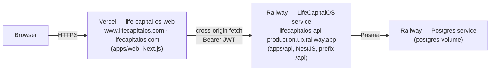

# Deployment Guide

> **As deployed today.** Life Capital OS runs as **two** services: the **web app on Vercel**
> and the **API + PostgreSQL on Railway**. This document was rewritten against the live
> Railway and Vercel dashboards; it replaces an earlier version that described three Vercel
> projects (including an `apps/admin` that does not exist) and a Supabase database.

## 1. Topology



| Layer | Platform | Project / service | Source | Public address |
| --- | --- | --- | --- | --- |
| **Frontend** | **Vercel** | project `life-capital-os-web` (Hobby) | `apps/web`, branch `main` | `www.lifecapitalos.com`, `lifecapitalos.com` |
| **Backend** | **Railway** | project `empowering-perception` → env `production` → service **`LifeCapitalOS`** | this repo, branch `main` | `https://lifecapitalos-api-production.up.railway.app` (routes under `/api`) |
| **Database** | **Railway** | service **`Postgres`** (with `postgres-volume`), same project | — | private, reached via `DATABASE_URL` |

**Key consequence:** the browser calls the API **cross-origin** (Vercel origin → Railway
origin), so **CORS on the API is load-bearing** — see §5.

---

## 2. Backend — Railway (`apps/api`)

Deployed from the repo root using [`railway.json`](../railway.json):

```jsonc
build:  NIXPACKS
        pnpm --filter @lcos/core build
     && pnpm --filter @lcos/api prisma:generate
     && pnpm --filter @lcos/api build
deploy: pnpm --filter @lcos/api exec prisma migrate deploy   // migrations run on every deploy
     && node apps/api/dist/main.js
        healthcheckPath: /api/health   (timeout 300s)
        restartPolicy:   ON_FAILURE, max 3 retries
```

- **Long-running Node process** (not serverless), listening on `0.0.0.0:$PORT`.
- **Migrations are applied automatically on every deploy** — no manual step for schema changes.
- Health check: `GET /api/health`. API docs (Swagger): `GET /api/docs`.

### Environment variables (Railway → service `LifeCapitalOS` → Variables)

21 service variables are set, plus 8 injected by Railway. Names only — never commit values.

| Variable | Purpose |
| --- | --- |
| `DATABASE_URL` | Postgres connection (points at the in-project **Postgres** service) |
| `NODE_ENV` | `production` |
| `PORT` | injected/consumed by `main.ts` |
| `JWT_ACCESS_SECRET`, `JWT_REFRESH_SECRET` | token signing (`openssl rand -hex 32`) |
| `JWT_ACCESS_TTL`, `JWT_REFRESH_TTL_DAYS` | token lifetimes (defaults `15m` / `30`) |
| `FIELD_ENCRYPTION_KEY` | AES-256-GCM key for PII at rest (32-byte hex) |
| **`CORS_ORIGINS`** | comma-separated **exact** allowed browser origins (production web) |
| **`CORS_PREVIEW_ORIGIN_REGEX`** | optional anchored regex allowing this project's Vercel **preview** origins (§5) |
| `SEED_ADMIN_EMAIL`, `SEED_ADMIN_PASSWORD` | credentials the seed script uses for the SUPERADMIN account |
| **`RESEND_API_KEY`** | enables real email sending. **Unset ⇒ emails are logged, not sent** (§4a) |
| **`EMAIL_FROM`** | From header, e.g. `Life Capital OS <no-reply@lifecapitalos.com>` |
| **`APP_URL`** | public web origin used to build links in emails; defaults to the first `CORS_ORIGINS` entry |
| `SANDBOX_RETURN_SECRETS` | **must be `false`/unset in production** — when true, OTP codes and password-reset tokens are returned in API responses |
| `RAZORPAY_KEY_ID`, `RAZORPAY_KEY_SECRET`, `RAZORPAY_WEBHOOK_SECRET`, `RAZORPAY_SANDBOX` | billing |
| `AA_PROVIDER`, `AA_API_KEY`, `AA_SANDBOX` | Account Aggregator |
| `REDIS_URL` | **currently unused by the code** (no Redis integration exists) — see §8 |

> **`DIRECT_URL` is not required.** `schema.prisma` declares only `url = env("DATABASE_URL")`;
> there is no `directUrl`. (The previous version of this doc wrongly listed it.)

---

## 3. Database — Railway Postgres

- A **Postgres service with a persistent volume (`postgres-volume`)** lives in the same
  Railway project and is referenced by the API's `DATABASE_URL`.
- The connection uses Railway's **private network** host (`postgres.railway.internal:5432`),
  so the database is **not reachable from the public internet**. Consequence: one-off admin
  and data tasks must be run from **inside** the project — the service's **Console** tab —
  not from a laptop or an external SQL client (unless a TCP proxy is deliberately enabled).
- **Schema** is managed by Prisma migrations in `apps/api/prisma/migrations` (13 to date),
  applied automatically by the deploy command. Every table carries **RLS lockdown**
  (RLS enabled, no policies), so only the application's DB role can read/write.
- **Money** is stored as `BigInt` minor units; **PII** (household/member/entity names, taxIds)
  is AES-256-GCM encrypted at the application layer.

### Seeding (plans, feature flags, admin + demo users)
The seed is **not** part of the deploy command — it must be run deliberately:

```bash
# Railway → service → Console/one-off command (env vars are already injected)
pnpm --filter @lcos/api exec ts-node prisma/seed.ts
```
It is **idempotent** (upserts) and creates: 3 plans, 5 feature flags, a **SUPERADMIN** using
`SEED_ADMIN_EMAIL` / `SEED_ADMIN_PASSWORD`, and a demo user with a sample balance sheet.

> **The admin login is whatever `SEED_ADMIN_EMAIL` / `SEED_ADMIN_PASSWORD` are set to in
> Railway** — not necessarily the code defaults (`admin@lifecapitalos.dev` / `Admin@12345`).

---

## 4. Frontend — Vercel (`apps/web`)

- Project **`life-capital-os-web`**, Root Directory `apps/web`, config in
  [`apps/web/vercel.json`](../apps/web/vercel.json) (builds `@lcos/core` then the Next app
  from the monorepo root).
- **Production** deploys from **`main`**; every PR gets a **preview** deployment.
- Domains: **`www.lifecapitalos.com`** and **`lifecapitalos.com`**.

**Environment variable:**

| Variable | Value |
| --- | --- |
| `NEXT_PUBLIC_API_URL` | `https://lifecapitalos-api-production.up.railway.app/api` |

> `NEXT_PUBLIC_*` is **inlined at build time**. Changing it requires a **redeploy**, not just a
> restart. Set it for **all environments** (Production *and* Preview), or previews will fall back
> to the code default `http://localhost:4000/api` and fail to reach the API.

---

## 4a. Email (password reset & verification)

Outbound email goes through a transport chosen at boot from the environment
(`apps/api/src/email/`). Two exist today:

| `RESEND_API_KEY` | Transport | Behaviour |
| --- | --- | --- |
| set | `resend` | real delivery via the Resend REST API |
| unset | `console` | the message is **written to the Railway log instead of being sent** |

The API logs which one it picked at boot, and logs an **error** (not a warning) if it falls
back to `console` in production — a deploy in that state has users who cannot reset their
password.

**To turn on real email:**

1. Create a Resend account and add `lifecapitalos.com` as a domain, then add the DNS records
   Resend shows you (SPF/DKIM) at the registrar. Skipping this still works for testing —
   leave `EMAIL_FROM` unset and it sends from Resend's shared `onboarding@resend.dev`, which
   only delivers to your own address.
2. Create an API key and set it on the Railway service as `RESEND_API_KEY`.
3. Set `EMAIL_FROM="Life Capital OS <no-reply@lifecapitalos.com>"` and
   `APP_URL="https://lifecapitalos.com"`.
4. Redeploy the Railway service and confirm the boot log says `Email transport: resend`.

Free tier is 3,000 emails/month (100/day), which is well beyond current volume.

**Swapping provider** (SES, Postmark, …) is one new file implementing `EmailTransport` plus
one branch in `email.module.ts`. No caller changes — nothing outside `src/email/` knows
which provider is in use.

---

## 5. CORS wiring (the two must agree)

The API allows an origin only if it matches `CORS_ORIGINS` **exactly**, or the optional
`CORS_PREVIEW_ORIGIN_REGEX`. Implementation: `apps/api/src/config/cors.ts`.

```bash
CORS_ORIGINS="https://lifecapitalos.com,https://www.lifecapitalos.com"
# Vercel previews get a NEW hostname per deploy, so they need a scoped pattern:
CORS_PREVIEW_ORIGIN_REGEX="^https://life-capital-os[a-z0-9-]*-dipankarfin58-8320s-projects\.vercel\.app$"
```

Rules that matter:
- **Never** use `*` — the API sends `credentials: true`.
- Pin the preview regex to **both** the project prefix **and** the Vercel team slug, and keep it
  anchored (`^…$`), so no third-party `*.vercel.app` site can match.
- List **both** apex and `www` if both serve the app.
- The origin option is an **array** (strings + optional RegExp), never a callback — a callback
  makes `cors` skip terminating the `OPTIONS` preflight, which then 404s.

**Verify:** `OPTIONS /api/auth/login` from the browser must return **204** with an
`Access-Control-Allow-Origin` equal to the calling origin.

---

## 6. Deploy flow

| Change | What happens |
| --- | --- |
| Merge to `main` touching `apps/web` | Vercel builds & promotes production automatically |
| Merge to `main` touching `apps/api` / `packages/core` / `prisma` | Railway rebuilds, **runs `prisma migrate deploy`**, restarts the API |
| Change a Railway variable | Redeploy the Railway service for it to take effect |
| Change `NEXT_PUBLIC_API_URL` | **Redeploy** the Vercel project (build-time inlining) |

Order when standing up a new environment:
1. Create the Postgres service; set `DATABASE_URL` on the API service.
2. Set the API's secrets (`JWT_*`, `FIELD_ENCRYPTION_KEY`, `SEED_ADMIN_*`, `NODE_ENV=production`), deploy, confirm `/api/health`.
3. Run the seed once (§3).
4. Set `NEXT_PUBLIC_API_URL` on Vercel, deploy the web app.
5. Set `CORS_ORIGINS` (+ preview regex) on the API to the web origins, redeploy the API.

---

## 7. Operations runbook

| Task | How |
| --- | --- |
| Check API health | `GET https://lifecapitalos-api-production.up.railway.app/api/health` |
| Browse the API | `…/api/docs` (Swagger UI — can also execute authenticated calls) |
| Apply a schema change | merge to `main`; migrations run on deploy |
| Inspect data | Railway → **Postgres** service → **Data**/query tab |
| Roll back the web app | Vercel → Deployments → **Instant Rollback** |
| Roll back the API | Railway → Deployments → redeploy a previous build |
| Rotate a secret | update the Railway variable → redeploy |

---

## 8. Known drift & clean-up candidates

| Item | Status |
| --- | --- |
| `apps/api/vercel.json` + `apps/api/api/index.js` | **Legacy** — from when the API ran as a Vercel serverless function. Unused now that the API is on Railway; safe to remove in a dedicated PR. |
| `REDIS_URL` variable | Set in Railway but **no code uses Redis**. Rate limiting is in-memory (per-instance). |
| `apps/admin` | Never existed; admin UI lives at `/admin` inside `apps/web`. |
| Supabase | **Confirmed not in use.** `DATABASE_URL` points at `postgres.railway.internal` (the in-project Railway Postgres). Any remaining Supabase project is legacy and can be decommissioned. |
| Password reset | **Works** as of the Phase 0 email milestone — but only once `RESEND_API_KEY` is set (§4a). Until then the reset link is written to the Railway log instead of being emailed. |
| Firm onboarding | New sign-ups have no firm and hit "No firm yet"; only an ADMIN/SUPERADMIN can create firms (`POST /api/firms`). |

---

## 9. Production checklist

- [ ] `NODE_ENV=production` on Railway, and **`SANDBOX_RETURN_SECRETS` is not `true`**.
- [ ] `SEED_ADMIN_PASSWORD` is strong and **rotated after first login** (never a code default).
- [ ] `JWT_ACCESS_SECRET`, `JWT_REFRESH_SECRET`, `FIELD_ENCRYPTION_KEY` are unique 32-byte random values — and `FIELD_ENCRYPTION_KEY` is **backed up** (losing it makes encrypted PII unreadable).
- [ ] `CORS_ORIGINS` lists the real web origins; preview regex is scoped and anchored.
- [ ] `NEXT_PUBLIC_API_URL` set for **Production and Preview** on Vercel.
- [ ] **Database backups enabled** on the Railway Postgres service.
- [ ] **Billing/credits monitored** — the Railway plan's credit balance gates the API *and* the database; if it lapses, the whole backend goes offline.
- [ ] **`RESEND_API_KEY` set** and the boot log says `Email transport: resend` — otherwise password-reset emails go to the log, not to users.
- [ ] `EMAIL_FROM` uses a domain verified in Resend, and `APP_URL` is the real web origin.
- [ ] Real Razorpay + Account Aggregator keys set; `RAZORPAY_SANDBOX=false`.
