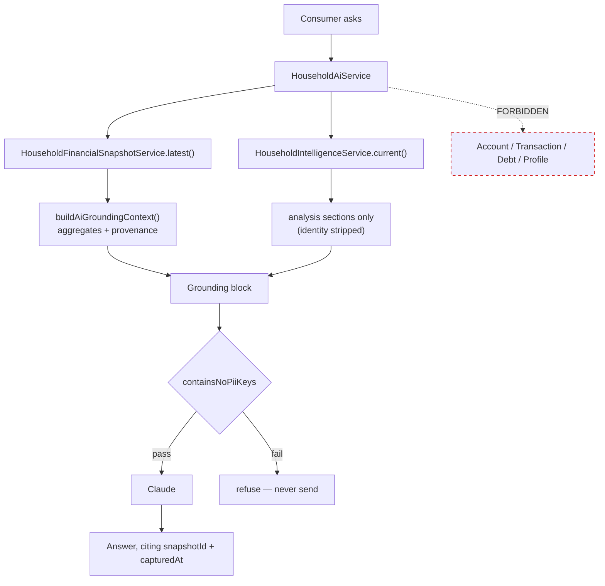

# M5.7 — AI Insights on the Financial Intelligence Layer — Architecture

> **Status:** Design, written before implementation.
> **Scope:** the V2 consumer AI surface — `/household/coach` becomes native and grounds on the
> Financial Intelligence Layer. V1's AI (`/ai/coach`, `/ai/second-opinion`, `AiService`) is
> **untouched and stays operational** as the safety net until Module 10.
> **Companions:** [`AI_INTEGRATION_ARCHITECTURE`](./architecture/AI_INTEGRATION_ARCHITECTURE.md),
> [`AI_GROUNDING_CONTRACT`](./architecture/AI_GROUNDING_CONTRACT.md),
> [`M5_FINANCIAL_INTELLIGENCE_LAYER`](./architecture/M5_FINANCIAL_INTELLIGENCE_LAYER.md),
> [`M5_6_HOUSEHOLD_DASHBOARD_ARCHITECTURE`](./M5_6_HOUSEHOLD_DASHBOARD_ARCHITECTURE.md).

---

## 0. What this milestone actually has to solve

Not "add a chatbot." The AI surface already exists in V1. Three specific things are wrong with it
for a V2 consumer, and each is load-bearing:

### 0.1 V1's AI cannot see a V2 consumer's money

`AiService.buildContext()` calls `FinancialSnapshotService.assemble(userId)`, which reads
`account.findMany({ where: { userId } })`. The Wealth Health Check writes **household-scoped**
records exclusively (`apps/web/src/lib/wealthHealth.ts`). So for a consumer who completed the
check with ₹20,00,000 of assets, V1's coach is grounded in a snapshot reading **₹0**.

This is the same defect class as the V1 dashboard (`docs/V2_PRIMARY_MIGRATION_PLAN.md` §0), but
strictly worse in consequence: a dashboard shows a wrong number, whereas an LLM *narrates* it —
turning ₹0 into fluent, confident, personalised advice for a family that is not broke.

### 0.2 V1's AI violates two standing architectural contracts

Both are already normative in this repository, and both predate M5.7:

| Contract | Rule | V1's behaviour |
| --- | --- | --- |
| `AI_INTEGRATION_ARCHITECTURE` §1 | "AI reads Financial Snapshots. AI never calculates from raw transactional tables." | Queries `Account`, `Debt`, `Goal`, `Profile` directly and re-aggregates |
| `AI_GROUNDING_CONTRACT` §1 | "Every AI feature MUST call `buildAiGroundingContext` and pass **only** its result to a model." | Hand-builds a prompt string; never calls it |

`buildAiGroundingContext` currently has **no callers anywhere in the codebase** — the contract, the
pure helper and its tests were shipped as M3 hardening, and nothing has consumed them since. M5.7 is
its first consumer.

This is not a criticism of V1. V1's AI predates the snapshot contract. It is the reason M5.7 is
built as a **new surface** rather than a modification of `AiService`: the V1 service would have to
be rewritten to comply, and it is explicitly preserved as the rollback path.

### 0.3 The AI would inherit whatever the layer says

Settled before this milestone rather than during it: the FIL reported net worth *before* the debt
ledger, so its `executiveSummary` paragraph — the text a narrative surface repeats verbatim —
overstated a family's net worth by the size of their loan. Fixed in the hotfix that preceded this
work (see `M5_6_HOUSEHOLD_DASHBOARD_ARCHITECTURE` §2.1).

The general principle it establishes, which M5.7 depends on: **the AI adds narration, not
arithmetic. Every number it says must already be correct before it says it.**

---

## 1. The rule this milestone implements

> **The V2 AI consumes the Financial Intelligence Layer and the redacted grounding context. It
> reads no financial table, and it computes no financial number.**

Concretely, the model receives exactly two derived objects and nothing else:

| Object | Built by | Contributes |
| --- | --- | --- |
| `AiGroundingContext` | `buildAiGroundingContext(envelope, payload)` | **The numbers** — PII-light aggregates + provenance (`snapshotId`, `schemaVersion`, `redactionVersion`) |
| `HouseholdFinancialIntelligence` (analysis sections) | `HouseholdIntelligenceService.current()` | **The conclusions** — `wealthHealth`, `risk`, `opportunity`, `recommendedActions`, `executiveSummary` |

Both derive from the same immutable snapshot, so they cannot disagree. Neither is a raw table.

### 1.1 Why both, rather than one

The grounding contract is satisfied by the first object alone, and a naive reading says stop there.
But `AiGroundingContext` carries aggregates without analysis: the model would have to decide for
itself whether a 0.20 debt-to-assets ratio is healthy — which is a financial judgement, and the
codebase already owns that judgement in `financialHealth.ts` and the Early Warning engine.

Letting the model re-derive it would be the exact duplication the kernel governance rule forbids,
and it would drift: the dashboard would say "Debt Burden: good" while the coach said something else
about the same number, on the same page, from the same snapshot.

So the FIL's **conclusions** are supplied as facts the model must not contradict, and the grounding
context supplies the **figures** it may cite. The model's job is to explain and converse, not to
assess.

---

## 2. PII: the hazard that is specific to this milestone

`HouseholdIntelligenceService.current()` ends with:

```ts
intelligence.household.name = this.crypto.decrypt(household.name);
```

The pure FIL object is PII-light by construction (`household.name` is `null`, ids only, coarse
demographics) — but the API layer **deliberately decrypts the family name into it** for the
dashboard header. Passing that object to a model as-is would send a real family's name to a
third-party LLM.

**Therefore:** the grounding builder takes the FIL object and strips identity before use — it
selects only the analysis sections by name, and never spreads the object wholesale. This is a
positive allow-list, not a `delete`, because a `delete` silently stops protecting the moment a new
identifying field is added to the section it guards.

`containsNoPiiKeys()` already exists in `@lcos/core` and is asserted before every model call.

---

## 3. Shape

```
POST /api/households/:id/ai/insights     → narrative summary of the FIL
POST /api/households/:id/ai/coach        → conversational, multi-turn
```

Both household-scoped and guarded by `HouseholdScopeGuard` (404-not-403), like every other
household route. Both read-only: the AI writes nothing to the kernel, and captures no snapshot.



### 3.1 Dependency boundary

`HouseholdAiService` depends **only** on `HouseholdIntelligenceService` and
`HouseholdFinancialSnapshotService`. It does not inject `PrismaService`, nor any accounts / cashflow
/ debt repository. That is a wiring guarantee reviewable in the module definition, per
`AI_INTEGRATION_ARCHITECTURE` §5 — not a convention anyone has to remember.

**This is the single most important structural property of the milestone**, and the one a test
should assert directly rather than trust.

---

## 4. Degradation: what happens with no API key

V1 falls back to re-printing its own context string at the user. M5.7 has something better
available, at zero marginal cost: **the FIL already produces a deterministic narrative** —
`executiveSummary.headline`, `paragraphs`, `highlights`, `watchouts`, and a ranked
`recommendedActions[]`, all composed by template from the same snapshot.

So the fallback is not a degraded imitation of the AI answer — it is the same analysis, without the
conversational phrasing. It fabricates nothing, and it is what the dashboard already shows.

`ai: false` is returned so the client can label it honestly. A user must never be told a
deterministic template was a personalised AI answer.

---

## 5. The two scoring engines stay separate

Standing instruction: *"Do not merge the V1 and V2 scoring engines yet. Keep the V1 retail scorer
operational until the planned V2 transition."*

M5.7 does not merge them, and does not touch V1:

| | Grounds on | Scored by | Reachable at |
| --- | --- | --- | --- |
| V1 AI | retail `Account.userId` | `computeWealthHealth` | `/ai/*`, and `/dashboard` |
| V2 AI | household snapshot → FIL | `computeFinancialHealthScore` | `/households/:id/ai/*`, `/household/coach` |

**The divergence is real and bounded.** The same family could in principle see two different scores.
In practice a V2 consumer's retail path holds no data at all, so V1 would score an empty snapshot —
and consumers are no longer routed to V1 anywhere (`CONSUMER_HOME = '/household'` since PR #53).
The exposure is a consumer who types `/dashboard` directly.

Reconciling the engines is a **separate, explicit milestone** with its own comparison and
verification, per the standing instruction. M5.7 must not quietly pre-empt it.

---

## 6. Entitlements — a product decision, flagged not assumed

`/ai/coach` and `/ai/second-opinion` are gated on the `ai_recommendations` entitlement. Verified
against a running API: a newly registered consumer receives

```
403  "This is a Premium feature. Upgrade to unlock it."
```

So `/household/coach` is an upgrade wall today, not a broken page. That is existing, deliberate
billing behaviour — not a defect.

It leaves a question M5.7 cannot answer on its own, because it is pricing, not architecture:

| Surface | Cost to serve | Proposed gate |
| --- | --- | --- |
| Deterministic insights (FIL narrative, already computed for the dashboard) | zero — same call the dashboard makes | **free** |
| LLM coach / conversation | per-token | **premium**, mirroring V1 |

The recommendation is the split above: a consumer should not hit a paywall to read a sentence
describing figures already rendered on their own dashboard, while the conversational model call —
the part with marginal cost — stays premium exactly as it is today.

**This is the founder's call.** If the whole surface should stay premium, the only change is where
the guard is applied; nothing else in this design moves.

---

## 7. Compatibility and preservation

| Preserved | How |
| --- | --- |
| `AiService`, `/ai/coach`, `/ai/second-opinion` | Untouched. Same code, same routes, same behaviour |
| V1 `WealthCoach` / `SecondOpinion` components | Untouched; still mounted on `/dashboard` |
| V1 retail scorer (`computeWealthHealth`) | Untouched — still grounds V1's AI |
| Financial Kernel, schema, snapshot payload | Untouched — **no schema change, no migration** |
| FIL | Consumed read-only; not modified |
| Advisor Workspace, admin, marketing, billing | Untouched |

`/household/coach` stops mounting the V1 components and renders the native V2 surface. The V1
components remain in the repository and reachable on `/dashboard`, per *"no destructive deletion
before Module 10."*

---

## 8. Testing strategy

Assert on **properties**, not on model output. An LLM response is not deterministic and must never
be asserted verbatim; what must hold is everything around it.

**Structural (the ones that matter most)**
- `HouseholdAiService` does not inject `PrismaService` or any engine repository — asserted from the
  module definition, so a future edit that reaches for a table fails the build rather than a review.
- The grounding block passes `containsNoPiiKeys()`.
- The family name never appears in the grounding block, even though the FIL object carries it —
  driven with a household whose name is a distinctive string, then asserted absent.

**Behavioural**
- With no API key: returns the FIL's own summary and actions, `ai: false`, and fabricates no figure.
- The answer's cited `snapshotId` equals the snapshot the dashboard is reading — one snapshot, one
  set of numbers, per the M5.6 property.
- A household with no snapshot gets "run your check", never a fabricated ₹0 narrative.
- Household scoping: another firm's household is a 404.
- Read-only: calling the AI captures no snapshot and writes no financial row.

**Regression**
- A family with a loan: the grounding figures carry the reconciled net worth, not the gross one.

**Teeth**: each new test is confirmed to fail against a deliberate regression before merge.

---

## 9. Rollback

| Change | Rollback | Data risk |
| --- | --- | --- |
| New AI endpoints | Additive — unrouting them removes the surface | none |
| `/household/coach` native | Revert one file; the V1 components it replaced are still present | none |
| Whole PR | `git revert` the merge, or redeploy the previous build | **none** |

Structurally safe: no schema change, no migration, no data written, nothing re-keyed. There is no
consistency window and nothing to restore.

---

## 10. Explicitly out of scope

- Merging the V1 and V2 scoring engines (separate milestone, by standing instruction)
- Retiring V1's AI or any V1 consumer surface (post-Module 10)
- Persisting AI conversations (no schema change in this milestone)
- The Protection data path — `coverTracked` is still always `false` (M5.9)
- Aligning the Advisor Workspace net-worth card with the reconciled figure (separate decision;
  it means changing a frozen kernel endpoint's meaning)
