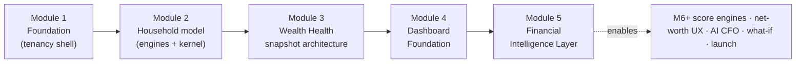
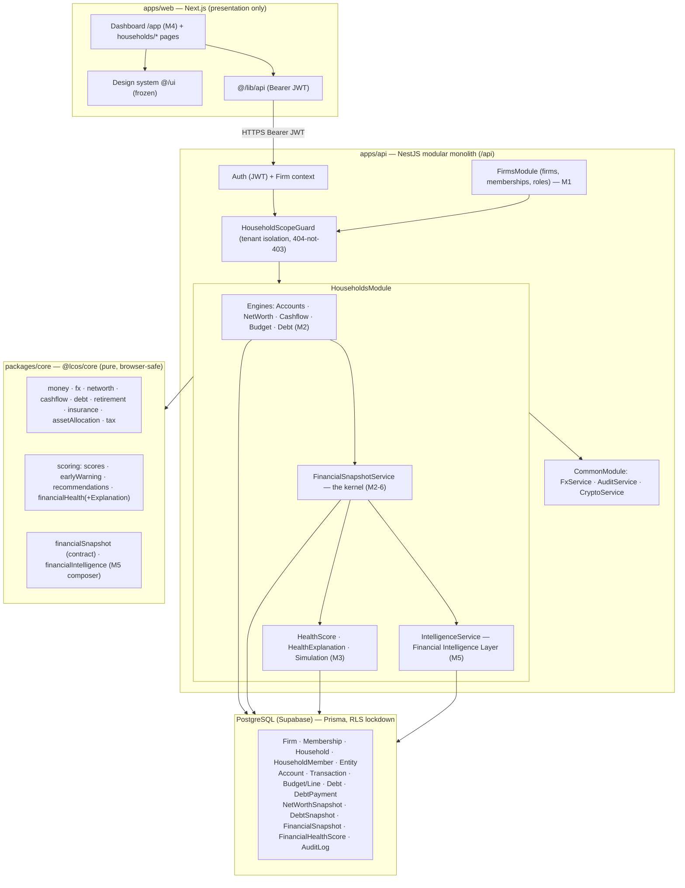
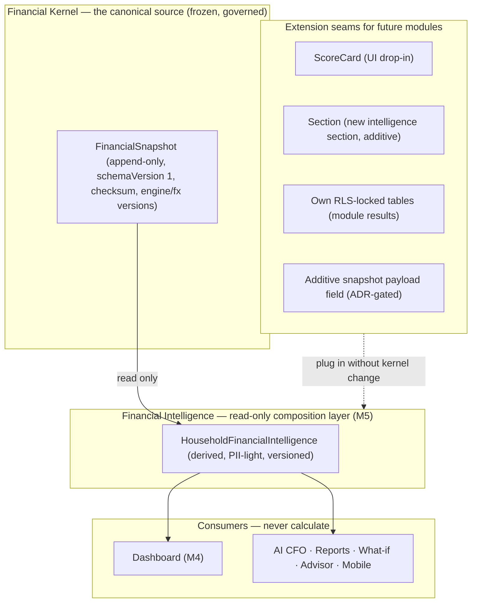

# Life Capital OS — V2 Master Architecture

> **Status:** Current production architecture after **Modules 1–5** (tenancy foundation → household model →
> Wealth Health snapshot architecture → Dashboard Foundation → Financial Intelligence Layer). Verified against
> the codebase at `main` following the merge of PR #28 (M5). This is the **master overview**; the deep
> per-area references live in [`docs/architecture/`](./architecture/):
> [`SYSTEM_ARCHITECTURE_V2`](./architecture/SYSTEM_ARCHITECTURE_V2.md),
> [`FINANCIAL_KERNEL_ARCHITECTURE`](./architecture/FINANCIAL_KERNEL_ARCHITECTURE.md),
> [`KERNEL_GOVERNANCE`](./architecture/KERNEL_GOVERNANCE.md),
> [`FUTURE_MODULE_CONTRACT`](./architecture/FUTURE_MODULE_CONTRACT.md),
> [`EXTENSION_GUIDELINES`](./architecture/EXTENSION_GUIDELINES.md),
> [`M4_DASHBOARD_FOUNDATION`](./architecture/M4_DASHBOARD_FOUNDATION.md),
> [`M5_FINANCIAL_INTELLIGENCE_LAYER`](./architecture/M5_FINANCIAL_INTELLIGENCE_LAYER.md).
>
> *(Historical note: this file previously held the pre-V2 analysis of the V1 retail system. It has been
> replaced with the current architecture. The prior V1 analysis is preserved in the git history.)*

---

## 0. Executive summary

Life Capital OS V2 is a **multi-tenant advisory wealth platform**: advisory **firms** manage **households**
(families), each holding **accounts, cashflow, budget, debt, and net worth**, consolidated multi-currency into
a household base currency and frozen as **immutable Financial Snapshots** — the canonical read model. On top of
that kernel, a **Financial Intelligence Layer** composes derived intelligence once and serves every consumer,
and a **customer Dashboard** is the first experience after login.

**pnpm + Turborepo monorepo**, TypeScript end-to-end, three deployables:

| Package | Stack | Responsibility |
| --- | --- | --- |
| `apps/api` | **NestJS 10 + Express**, global `/api` prefix | HTTP API; thin controllers → services → `@lcos/core`; auth, tenancy, persistence. |
| `apps/web` | **Next.js (App Router) + Tailwind** | Advisor/customer workspace (`/app/**`); reads the API over Bearer JWT; **presentation only**. Design system `apps/web/src/ui/*` is **frozen**. |
| `packages/core` | **`@lcos/core`** — pure TypeScript, **browser-safe** | All finance math: money (BigInt minor units), FX, net worth, cashflow, budget, debt, scoring, and the derived-intelligence composer. No IO/DOM. |

**Persistence:** PostgreSQL via **Prisma**; **every table has RLS lockdown** (enabled, no policies) so the
Supabase PostgREST surface is closed. **Migrations are additive** (13 to date). **PII** (household/member/
entity names, taxIds) is **AES-256-GCM encrypted at rest**. Deploy: **Vercel** (web) + **Railway** (API +
Postgres).

**Core architectural laws** (enforced across all modules, ADR-001…012):

1. **Household is the aggregate root** — every financial row is scoped by `householdId` (+ `firmId`).
2. **FX lives only in the domain layer** — store native currency; convert at aggregation (ADR-003, `fx.ts`).
3. **Financial history is immutable** — snapshots are append-only, never updated/deleted (ADR-004).
4. **Migrations are additive** — new tables / nullable columns only; retail rows coexist (ADR-010).
5. **Thin controllers, pure core** — no business math in controllers or the browser.
6. **One calculation, many consumers** — derived intelligence is composed once (M5) and read everywhere.

---

## 1. Module history (1–5) — what shipped



### Module 1 — Foundation (multi-tenancy shell)
The tenancy backbone the whole platform stands on. Introduced **`Firm`**, **`Membership`** (firm roles
`OWNER / ADVISOR / SUPPORT / ANALYST`), **`Household`**, **`HouseholdMember`**, and **`Entity`** (legal
entities within a household). Auth resolves the caller's active firm; **`HouseholdScopeGuard`** gates every
household route — OWNER/ANALYST read firm-wide, ADVISOR/SUPPORT only their assigned households, out-of-scope →
**404 (never 403)** so existence never leaks. Writes are gated `@FirmRoles(OWNER, ADVISOR, SUPPORT)`; ANALYST
is read-only; every mutation is audited. *(Migrations `add_tenancy_firm_household`, `add_user_active_firm`,
`add_advisory_scoping_columns`.)*

### Module 2 — Household model (financial engines + the kernel)
The financial substance, as five household-scoped **engines** plus the **Financial Snapshot kernel**:

| Slice | Engine / surface | Owns (write) | Live read |
| --- | --- | --- | --- |
| M2-2 | **Accounts** | `Account` (native ccy, entity-owned, `isLiability`) | account list |
| M2-3 | **Net Worth** | immutable `NetWorthSnapshot` | `/net-worth/current` (assets/liabilities/net worth/solvency, base ccy) |
| M2-4 | **Cashflow + Budget** | `Transaction`, `Budget`/`BudgetLine` | `/cashflow/summary`+`/timeline`, budget-vs-actual |
| M2-5 | **Debt & Payoff** | `Debt`, `DebtPayment`, immutable `DebtSnapshot` | `/debts/summary`+`/payoff` (snowball/avalanche) |
| M2-6 | **Financial Snapshot (kernel)** | immutable `FinancialSnapshot` | `/financial-snapshot/{current,latest,timeline,:id}` |
| M2-7 | **Balance Sheet UI** | — (web) | `/app/households/[id]/balance-sheet` (+ cashflow, debt pages) |

The kernel **composes the five engines + core FX** into one canonical, versioned, checksummed payload
(`schemaVersion 1`) and appends an immutable row. It introduces **no aggregation math of its own**.
**Multi-currency is fully resolved** (`fx.ts`): native at rest, converted to the household base currency at
aggregation, with the rate-set id (`fxVersion`) frozen into each snapshot for reproducibility.

### Module 3 — Wealth Health snapshot architecture
The first **consumers** of the kernel — pure functions of one immutable snapshot, each storing results in its
**own** table (never mutating the kernel):

- **M3-1 Financial Health Score** — `computeFinancialHealthScore(payload)` → 0–100 overall + 5 weighted
  categories (net worth, debt burden, savings, liquidity, diversification), each explainable. Persisted in
  **`FinancialHealthScore`** (tied to a `snapshotId`). Routes `/health-score/{current,latest,timeline,:id}`.
- **M3-2 Health Explanation** — `explainFinancialHealth(score, payload)` → strengths, weaknesses, ranked
  recommendations with estimated impact. Consumes a score; never re-derives one.
- **M3-3 What-if Simulation** — `financialSimulation.ts` seeds from a snapshot and applies in-memory deltas;
  never mutates the base snapshot. Route `/simulation`.

### Module 4 — Dashboard Foundation
The **first experience after login** at **`/app`**, answering "How financially healthy is my family?" in three
sections: **Executive Summary** (household selector, family summary, **live Net Worth**, Wealth Health Score),
**Capital Health** (reusable **`ScoreCard`** cards — the extension seam), **AI Guidance** (AI Family CFO™
placeholder, live Recent Activity, Quick Actions). Presentation-only; composes the **frozen** `@/ui` design
system; reads existing APIs. The advisor Book overview relocated to `/app/book`. Components under
`apps/web/src/components/dashboard/*`.

### Module 5 — Financial Intelligence Layer
The **single reusable consumer of the kernel** — the source of truth for **derived intelligence** (the kernel
remains the source of truth for **facts**). A pure `@lcos/core` composer,
**`computeHouseholdFinancialIntelligence`**, turns one immutable snapshot into the canonical
**`HouseholdFinancialIntelligence`** object by **composing the existing calculators** (health score +
explanation, emergency fund, insurance gap, retirement, asset allocation, early warning) — **no new math**.
Deterministic (no IO/clock/randomness/FX), **PII-light** (ids + coarse demographics; name resolved at the
decrypted boundary), with `Section<T>` graceful degradation. Exposed read-only at
**`GET /households/:id/intelligence/current`**; depends only on `HouseholdFinancialSnapshotService` (read) +
`CryptoService`. **No schema change** — live compute; persistence is a documented follow-up.

---

## 2. Component diagram (as implemented)



**Notes:** one NestJS modular monolith; all household finance lives in `HouseholdsModule`
(`apps/api/src/households/`), one `*.controller.ts` + `*.service.ts` per resource. `FxService`,
`AuditService`, `CryptoService` are global (`CommonModule`). The **kernel composes the engines**; **M3/M5
consume snapshots** and never re-aggregate raw tables. *(A V1 **retail** stack — `accounts`, `transactions`,
`debts`, `goals`, `family`, `networth`, `insights`, `ai`, `tools`, keyed by nullable `userId` — coexists
additively per ADR-010; the firm/household advisory stack above is the V2 platform Modules 1–5 built.)*

---

## 3. The canonical data flow

> **Household → Snapshot Services → Financial Intelligence Layer → Dashboard → Future Score Engines**

```mermaid
flowchart LR
  subgraph H["Household (facts)"]
    A["Accounts · Cashflow · Budget · Debt · Net Worth<br/>(engines record native-currency facts)"]
  end
  subgraph S["Snapshot Services (the kernel)"]
    FS["FinancialSnapshot — composed, FX-consolidated,<br/>immutable, versioned, checksummed (canonical source of truth)"]
  end
  subgraph I["Financial Intelligence Layer (M5)"]
    FIL["computeHouseholdFinancialIntelligence — read-only composition<br/>of the existing calculators → HouseholdFinancialIntelligence"]
  end
  subgraph C["Consumers"]
    D["Dashboard (M4)"]
    AI["AI Family CFO™ (M8)"]
    R["Reports"]
    W["What-if Simulator (M9)"]
    ADV["Advisor Workspace"]
    MOB["Future Mobile App"]
  end
  subgraph E["Future Score Engines (M6+)"]
    SE["Wealth Health Score Engine · Risk · Retirement · Insurance …<br/>(each a snapshot consumer, own tables)"]
  end

  A -->|capture| FS
  FS -->|latest / getById / timeline (READ ONLY)| FIL
  FIL --> D & AI & R & W & ADV & MOB
  FS -->|READ ONLY| SE
  SE -->|surfaced through| FIL
  FIL -. never writes .-> FS
  linkStyle 10 stroke:#c00,stroke-dasharray:5 5
```

1. **Household → Snapshot Services.** Engines record facts (native currency). A capture composes them, converts
   to the base currency, checksums, and appends an **immutable** `FinancialSnapshot` — the **canonical source
   of truth**. `/current` is a live preview and is never persisted.
2. **Snapshot Services → Financial Intelligence Layer.** M5 reads a snapshot **read-only** (`latest` /
   `getById` / `timeline`) and composes the derived `HouseholdFinancialIntelligence` object. It performs no FX,
   holds no facts, and never writes the kernel.
3. **Financial Intelligence Layer → Dashboard.** The Dashboard (and every other consumer) reads that one
   object — the `ScoreCard` seam binds a card to `intelligence.<section>` with no layout redesign.
4. **→ Future Score Engines.** New engines (M6+) are **snapshot consumers** writing their own tables; their
   outputs surface through the same intelligence object, so consumers keep reading one shape.

---

## 4. The kernel as canonical source, and the layers above it



- **Financial Snapshot is the canonical source.** Governance G-1…G-6 freeze it: append-only, `schemaVersion 1`
  field meanings immutable, additive-only evolution, kernel changes require an ADR + review. Consumers read
  snapshots; nothing above re-aggregates raw tables. *(See [`KERNEL_GOVERNANCE`](./architecture/KERNEL_GOVERNANCE.md).)*
- **Financial Intelligence is a read-only composition layer.** It derives, never records. A corrected snapshot
  simply yields new intelligence; there is no second source of truth.
- **Dashboard is a consumer.** Presentation-only; it renders sections of the intelligence object and degrades
  gracefully when a section is `available: false`.
- **Extension seams for future modules** (all additive, none touching the kernel):
  - **`ScoreCard`** — the UI drop-in every future score card uses (placeholder → live is a data change).
  - **`Section<T>`** — a new intelligence section is an optional, additive field on the canonical object.
  - **Own tables** — a module writes only its own RLS-locked, household-scoped tables (per
    [`FUTURE_MODULE_CONTRACT`](./architecture/FUTURE_MODULE_CONTRACT.md)).
  - **Additive payload field** — a genuinely new *consolidated fact* is added to the snapshot through the
    kernel's ADR-gated process, never invented in a consumer.

---

## 5. Tenancy, security & data model (current)

- **Tenancy/authz:** `HouseholdScopeGuard` resolves `/households/:id`, requires an active `Membership`, and
  intersects with assignment (OWNER/ANALYST firm-wide read; ADVISOR/SUPPORT assigned-only). Out-of-scope →
  404. Writes `@FirmRoles(OWNER, ADVISOR, SUPPORT)`; ANALYST read-only.
- **Audit:** append-only `AuditLog` on every mutation (`firmId` now a first-class column —
  `backfill_auditlog_firmid`).
- **Encryption:** household/member/entity names + taxIds AES-256-GCM at rest (`CryptoService`).
- **RLS lockdown:** every table (all 28 models) has RLS enabled with no policies; Prisma's role is the only
  reach into Postgres.
- **Prisma models (28):** tenancy (`Firm`, `Membership`, `Household`, `HouseholdMember`, `Entity`); engines
  (`Account`, `Transaction`, `Budget`, `BudgetLine`, `Debt`, `DebtPayment`, `NetWorthSnapshot`,
  `DebtSnapshot`); kernel (`FinancialSnapshot`); M3 (`FinancialHealthScore`); retail V1 coexisting
  (`Profile`, `FamilyMember`, `Goal`, `Recommendation`); platform (`User`, `Plan`, `Subscription`,
  `FeatureOverride`, `FeatureFlag`, `Consent`, `RefreshToken`, `OtpCode`, `AuditLog`). **13 additive
  migrations.**
- **Multi-currency:** supported `INR, USD, EUR, GBP, AED, SGD`; native at rest; converted only in the domain
  layer via `FxService`/`convertMinor`; consolidated figures in the household base currency; `fxVersion`
  stamped per snapshot. *(This closes the V1 "no FX" gap.)*

---

## 6. `@lcos/core` (pure, browser-safe) — the shared brain

- **money** — BigInt minor units, `CurrencyCode`; **fx** — `convertMinor`, provider (static, swappable).
- **finance calculators** — `networth`, `cashflow`, `debt`, `retirement`, `insurance` (emergency fund + life
  cover gap), `assetAllocation`, `tax`, `goals`.
- **scoring** — `scores`, `earlyWarning`, `recommendations`, `financialHealth` (+ `financialHealthExplanation`).
- **contracts / composition** — `financialSnapshot` (payload types + canonical serializer + up-converter),
  **`financialIntelligence`** (the M5 composer), `financialSimulation`, `aiGrounding` (PII-redacted AI
  grounding context).
- Covered by **120 unit tests** (Vitest). Everything above the kernel reuses these functions; new finance/
  scoring belongs here, not in services.

---

## 7. Current Platform Status

**Completed**

- ✅ **Module 1 Complete** — Foundation (multi-tenancy: firms, memberships, households, members, entities; scope guard, roles, audit).
- ✅ **Module 2 Complete** — Household model (Accounts, Net Worth, Cashflow, Budget, Debt engines + the immutable Financial Snapshot kernel + Balance Sheet UI; multi-currency FX).
- ✅ **Module 3 Complete** — Wealth Health snapshot architecture (Financial Health Score, Health Explanation, What-if Simulation — snapshot consumers).
- ✅ **Module 4 Complete** — Dashboard Foundation (`/app` customer dashboard; reusable `ScoreCard` seam; AI CFO placeholder).
- ✅ **Module 5 Complete** — Financial Intelligence Layer (canonical `HouseholdFinancialIntelligence`; read-only composition of existing calculators; `GET /intelligence/current`).

**Upcoming**

| Module | Focus |
| --- | --- |
| **Module 6** | **Wealth Health Score Engine** — dedicated score engines plugging into the intelligence object + `ScoreCard` seam. |
| **Module 7** | **Family Balance Sheet & Net Worth Experience** — the consolidated net-worth UX. |
| **Module 8** | **AI Family CFO™** — snapshot-grounded guidance narrating the intelligence object (no calculation). |
| **Module 9** | **What-if Simulator** — scenarios seeded from a snapshot, re-composed through the intelligence layer. |
| **Module 10** | **Production Launch** — hardening, observability, release. |

Health baseline at M5 close: lint 4/4, `@lcos/core` 120 tests, API unit suites green (+ e2e in CI's DB job),
build 3/3, `main` deployable, Vercel preview healthy.

---

## 8. How to extend (the one-paragraph contract for M6+)

A future module **reads consolidated truth only from Financial Snapshots** (via `FinancialSnapshotService`),
**composes/derives in pure `@lcos/core`**, **writes only into its own additive, RLS-locked, household-scoped
tables**, and **never mutates the kernel or any engine data**. It surfaces through the **Financial Intelligence
Layer** (a new `Section<T>`) and the Dashboard (`ScoreCard`) without a redesign. A genuinely new *consolidated
fact* is added to the snapshot **additively**, ADR-gated. Full rules:
[`FUTURE_MODULE_CONTRACT`](./architecture/FUTURE_MODULE_CONTRACT.md) ·
[`EXTENSION_GUIDELINES`](./architecture/EXTENSION_GUIDELINES.md) ·
[`KERNEL_GOVERNANCE`](./architecture/KERNEL_GOVERNANCE.md).

---

## Appendix A — Tech stack (as built)

TypeScript · pnpm + Turborepo · NestJS 10 + Express · Prisma 5 + PostgreSQL · Next.js (App Router) · Tailwind ·
Zod · class-validator · Argon2id · JWT (access + rotating hashed refresh) · AES-256-GCM field encryption ·
Jest (API unit + e2e) + Vitest (`@lcos/core`) · Deploy: Vercel (web) + Railway (API + Postgres). AI grounding
via a PII-redacted context contract (`aiGrounding.ts`) for the forthcoming AI fleet.

## Appendix B — Key API surface (household-scoped, `/api/households/:id/...`)

`net-worth/{current,snapshot,timeline}` · `accounts` · `cashflow{,/summary,/timeline}` · `budget` ·
`debts{,/summary,/payoff,/:id/payments,/snapshot,/timeline}` ·
`financial-snapshot/{current,latest,timeline,:id}` (the kernel) ·
`health-score/{current,latest,timeline,:id}` · `health-explanation` · `simulation` ·
**`intelligence/current`** (M5) · `members` · `entities`. Firm-level: `/api/firms/*`, `/api/households`. All
gated by `HouseholdScopeGuard`; writes role-gated; every mutation audited.

---

*This document describes the current implementation; it is documentation only — no application code, schema, or
ADR was changed in producing it.*
