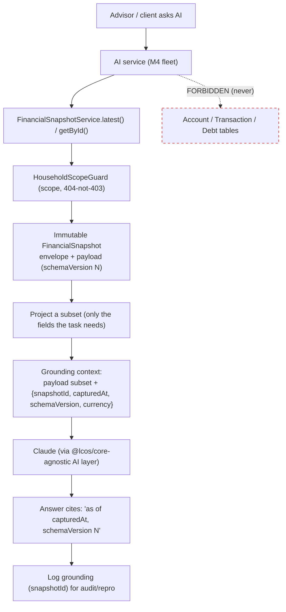

# Life Capital OS V2 — AI Integration Architecture

> **Permanent reference** for how AI consumes the Financial Kernel. Companion to
> [`FINANCIAL_KERNEL_ARCHITECTURE.md`](./FINANCIAL_KERNEL_ARCHITECTURE.md) and
> [`M2_FINANCIAL_SNAPSHOT_CONTRACT.md`](./M2_FINANCIAL_SNAPSHOT_CONTRACT.md) §11. Describes the **target
> contract** for the M4 AI fleet; the enforcement rules here are architectural laws, not yet-shipped code.

## 1. The one rule

> **AI reads Financial Snapshots. AI never calculates from raw transactional tables.**

Every AI feature (coach, second opinion, wealth advisor, insights, scores narration) grounds on a **specific
`FinancialSnapshot`** — its immutable, checksummed, versioned payload — obtained through
`HouseholdFinancialSnapshotService` (`latest()` / `getById()`), the same household-scoped, guarded read path
as any consumer. AI **must not** query `Account` / `Transaction` / `Debt` directly and **must not**
re-aggregate.

## 2. Why (the four reasons this is non-negotiable)

1. **Reproducibility.** An AI answer cites the snapshot id + `schemaVersion` it used; the frozen payload +
   `checksum` mean the exact input can be re-presented and the answer re-derived years later.
2. **Safety.** The snapshot is validated, reconciled, checksum-verified, and complete — never a half-written
   ledger or a mixed-currency sum. AI reasons over a coherent state.
3. **Tenant isolation.** One scoped row through `HouseholdScopeGuard` (404-not-403) — not broad table scans
   that could cross households/firms.
4. **Cost & determinism.** Bounded, structured context (one payload) instead of unbounded transaction history;
   cheaper, faster, and stable across calls.

## 3. Consumption flow

## 4. What AI receives

- **Envelope metadata:** `snapshotId`, `capturedAt`, `schemaVersion`, `engineVersion`, `fxVersion`,
  `currency`, `status` — so the model can state the basis and refuse stale/void snapshots.
- **Payload (or a projected subset):** `netWorth`, `debt`, `cashflowSummary`, `budgetSummary`,
  `assetAllocation`, `currencyExposure`, `householdEquity`, `entityHoldings`, `relationships` — **ids and
  amounts only, no PII** (names/taxIds stay encrypted in source tables). AI features requiring a human label
  resolve it separately through the guarded, decrypted read boundary — never from the payload.

## 5. Enforcement (structural, not convention)

- **Dependency boundary.** AI services depend **only** on `HouseholdFinancialSnapshotService` read methods —
  not on `HouseholdAccountsService`/`Cashflow`/`Debt` repos. This is a module-wiring guarantee, reviewable in
  DI.
- **Read-only.** AI never writes through the kernel; capture remains an OWNER/ADVISOR/SUPPORT action. Any
  AI-suggested change is a **recommendation** surfaced to a human, applied via the normal write path.
- **Grounding is logged.** The snapshot id used for an answer is recorded (audit/repro).
- **Versioning aware.** AI pins to `schemaVersion`; an `upgradePayload` up-converter can present older
  snapshots at the latest shape so the AI layer handles one shape.

## 6. What AI must NOT do

- ❌ Query or aggregate `Account` / `Transaction` / `Debt` directly.
- ❌ Recompute net worth, cashflow, debt, or FX (all already in the snapshot, base currency).
- ❌ Mutate a snapshot or write financial rows.
- ❌ Emit PII it wasn't explicitly, separately, and lawfully given.
- ❌ Treat `/current` (live preview) as an auditable record — ground on **captured** snapshots.

## 7. Roadmap hooks (M4)

The M4 agent fleet plugs in here without kernel changes: **Financial Health Score** (pure function of one
snapshot), **AI Wealth Advisor** (narrates a snapshot + payoff/allocation), **What-if** (seeds a simulation
from a snapshot, never mutating it). Each is a **snapshot consumer** per §1–§5.
