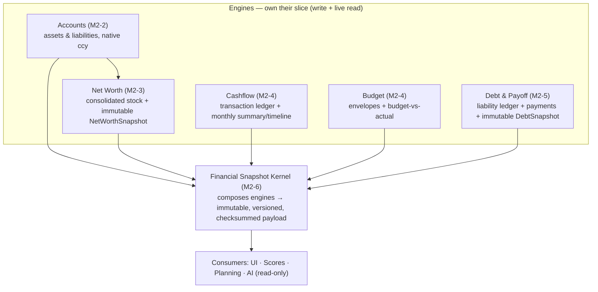
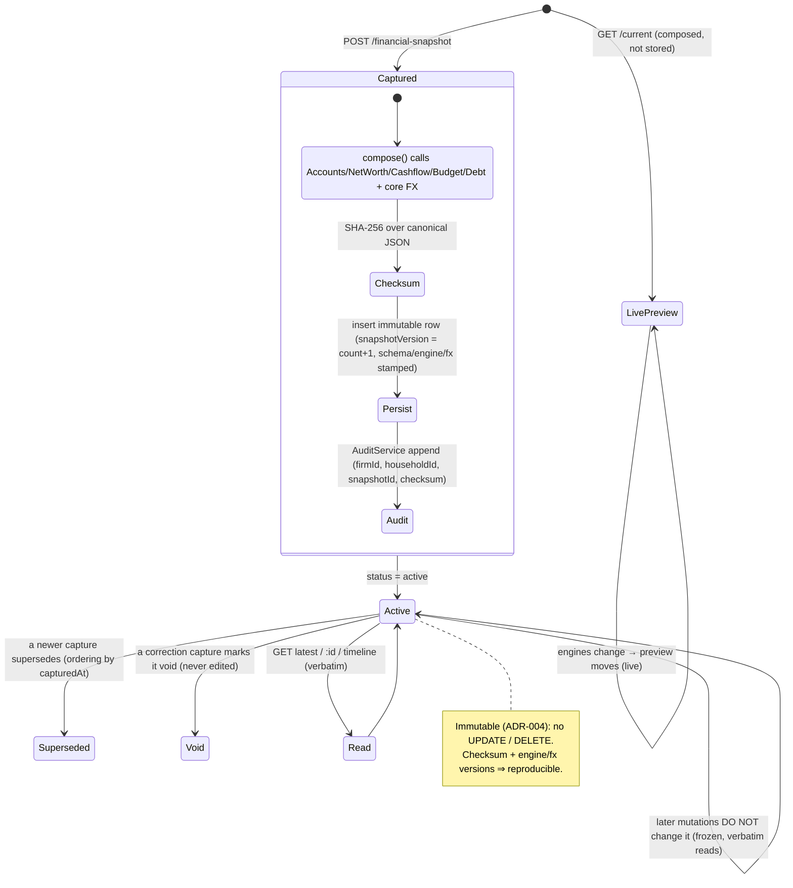

# Life Capital OS V2 — Financial Kernel Architecture

> **Permanent reference** for the financial engines and the Financial Snapshot kernel, **as implemented**
> (M2-2…M2-6, PRs #15–#20). Companion to [`SYSTEM_ARCHITECTURE_V2.md`](./SYSTEM_ARCHITECTURE_V2.md) and the
> canonical [`M2_FINANCIAL_SNAPSHOT_CONTRACT.md`](./M2_FINANCIAL_SNAPSHOT_CONTRACT.md).

## 1. What the Financial Kernel is

The **Financial Kernel** is the set of household financial **engines** (accounts, net worth, cashflow, budget,
debt) plus the **Financial Snapshot** that composes them into one immutable, versioned, canonical read model.
Everything above the kernel (dashboards, scores, planning, AI) **reads snapshots**; nothing above it
re-aggregates raw tables.

## 2. The engines (read/write responsibilities)

| Engine | Owns (write) | Live read (computed) | Immutable history | Reused `@lcos/core` |
| --- | --- | --- | --- | --- |
| **Accounts** (M2-2) | `Account` CRUD; entity-owned; native ccy | account list | — | — |
| **Net Worth** (M2-3) | captures snapshots | `/current` (assets/liabilities/net worth/solvency, base ccy) | `NetWorthSnapshot` | `computeNetWorth`, `convertMinor` |
| **Cashflow** (M2-4) | `Transaction` CRUD (income/expense/transfer/adjustment) | `/summary`, `/timeline` (base ccy; transfer/adjustment/void excluded) | — (ledger is the record) | `summarizeCashflow`, `convertMinor` |
| **Budget** (M2-4) | `Budget`+`BudgetLine` upsert | budget-vs-actual (live actuals from ledger) | — | `evaluateBudget` |
| **Debt & Payoff** (M2-5) | `Debt` CRUD, `DebtPayment`; captures snapshots | `/summary`, `/payoff` (snowball/avalanche) | `DebtSnapshot` | `summarizeDebt`, `simulateDebtPayoff`, `convertMinor` |
| **Financial Snapshot** (M2-6) | captures snapshots | `/current` (composed preview) | `FinancialSnapshot` | `canonicalStringify`, payload types, all of the above via services |

**Write responsibilities** are confined to each engine's service; **read responsibilities** for consolidated
truth belong to the kernel. A future module **never writes** through the kernel and **never reads** raw
engine tables for aggregation.

## 3. The five verified subsystems

### Household Accounts (M2-2)
`Account` rows are household-scoped, optionally entity-owned, stored in **native currency** with an
`isLiability` flag and optional `assetClass`. They are the **basis of net worth** (assets vs liabilities) and
the **currency/entity context** for everything else. `userId` is nullable (retail vs advisory duality).

### Cashflow Engine (M2-4)
The `Transaction` ledger is the **single source of truth for financial activity**. Types
`income | expense | transfer | adjustment`; `transfer`/`adjustment`/`void` are **excluded** from income/expense
totals. Native currency stored; converted at aggregation. Monthly **summary** and **timeline** are computed
live via `summarizeCashflow`. The **Budget** sub-engine stores envelopes and computes **budget-vs-actual**
against live ledger actuals (`evaluateBudget`).

### Debt & Payoff Engine (M2-5)
A **detailed liability ledger** parallel to net-worth accounts (ADR-011): type, secured flag, rate, EMI,
`outstandingMinor`, lifecycle `status` (`active|closed|written_off|archived`). `DebtPayment` records
repayments (`emi|extra|prepayment|foreclosure`) — the principal portion reduces `outstandingMinor`;
foreclosure closes the debt; an optional `transactionId` links to the cashflow ledger (reuse, not duplicate).
**Payoff** projections reuse `simulateDebtPayoff`; **summary** reuses `summarizeDebt`. Immutable `DebtSnapshot`
freezes debt history.

### Net Worth Engine (M2-3)
`/current` converts each account to the household base currency (`convertMinor`) then `computeNetWorth`
(assets, liabilities, net worth, solvency) — **computed live, never stored**. `POST /net-worth/snapshot`
freezes an **immutable `NetWorthSnapshot`**; `/timeline` is the history. This is the **stock** view (balance
sheet), complementing cashflow's **flow** view.

### Immutable Financial Snapshot (M2-6) — the kernel
Composes all of the above into one payload (see §4/§5) and appends an **immutable, versioned, checksummed
`FinancialSnapshot`**. It introduces **no new aggregation math** — it calls the engine services + core FX and
reconciles net worth with debt in `householdEquity` (ADR-012).

## 4. Snapshot contract (envelope + payload) — as implemented

**Envelope** (columns): `id`, `householdId`, `firmId`, `entityId?` (reserved, null in v1), `capturedAt`,
`snapshotVersion` (ordinal per household), `schemaVersion` (=1, the consumer contract), `engineVersion`
(`m2-6.x`), `fxVersion` (`FxService.version`), `currency` (base), `generatedBy`
(`manual|scheduled|event|migration`), `createdById?`, `checksum` (SHA-256 over canonical JSON), `status`
(`active|superseded|void`), `provenance` (source ids/counts), `payload`.

**Payload (`schemaVersion 1`)** — top-level keys, all money in base-currency minor units:
`netWorth`, `assets[]`, `liabilities[]`, `debt`, `cashflowSummary`, `budgetSummary`, `assetAllocation[]`,
`currencyExposure[]`, `householdEquity`, `entityHoldings[]`, `relationships` (ids/counts only — **no PII**).

**Reconciliation (ADR-012):** `netWorth.liabilities` stays the M2-3 **account-based** figure (net worth
unchanged/backward-compatible); `debt` is the M2-5 **ledger**; `householdEquity` exposes
`netWorthMinor`, `totalDebtMinor`, and `reconciledEquityMinor = netWorth − totalDebt` — the one place the two
liability views are unified.

## 5. Read/write, append-only history & versioning

- **Append-only, immutable, read-only (ADR-004).** Capture **inserts** a new row; there is **no update/delete**
  path. Stored snapshots are returned **verbatim** — reading never recomputes. Corrections are **new**
  snapshots (`status = void` on the old via a new capture), never edits.
- **Checksum.** `checksum = SHA-256(canonicalStringify(payload))` where `canonicalStringify` recursively
  **sorts object keys** (arrays keep order) so equal payloads hash identically. Verified on read; never
  regenerated in place. (Crypto is server-side; the canonical serializer is pure `@lcos/core`.)
- **Three versions travel with every snapshot:**
  - `schemaVersion` — the **payload contract**; consumers pin to it. **Additive-only**; a breaking change
    bumps to _N+1_ and **old rows are never rewritten**. An `upgradePayload(payload, from, to)` registry
    (identity for v1) can present old payloads at a newer shape **on read**.
  - `engineVersion` — composing-logic semver (debug/repro; doesn't gate consumers).
  - `fxVersion` — the rate set; frozen into converted figures so a rate change never alters a past snapshot.
- **The one live path:** `GET …/financial-snapshot/current` composes against live data and is **never
  persisted** (no id/checksum/status) — a preview, structurally distinct from a snapshot.

## 6. Financial Snapshot Lifecycle Diagram

**Creation triggers (`generatedBy`):** `manual` (built, `POST`), `scheduled` (month/quarter/year-end — M0
worker, deferred; contract ready), `event` (material financial event — hook points exist, M6 event bus),
`migration` (schema up-convert re-capture). **M2-6 captures are household-level** (`entityId = null`);
per-entity capture is a reserved, forward-compatible envelope field.

## 7. FX handling in the kernel

Composition converts every native amount to the household base currency via `FxService`/`convertMinor`
(ADR-003) **before** aggregation — never a mixed-currency sum. The **rate set identifier** (`FxService.version`)
is stamped as `fxVersion`, making each snapshot's conversions reproducible. Static/config provider today;
swappable for a live/historical feed without call-site changes.

## 8. AI consumption model (summary)

AI **reads Financial Snapshots only** — never raw `Account`/`Transaction`/`Debt` tables, and never
re-aggregates. It grounds on a specific `snapshotId` (or `latest`), receives the payload + envelope (so it can
cite "as of `capturedAt`, `schemaVersion` N"), and treats it as read-only. Full model + diagram in
[`AI_INTEGRATION_ARCHITECTURE.md`](./AI_INTEGRATION_ARCHITECTURE.md).

## 9. Guarantees the kernel provides to future modules

1. **One stable, versioned read shape** (`schemaVersion`) — depend on it, not on engine internals.
2. **Immutable, reproducible history** — snapshots + checksum + engine/FX versions.
3. **Multi-currency already resolved** — everything in the household base currency.
4. **No duplication** — consume summaries; never re-implement aggregation.
5. **Additive evolution** — new needs are optional payload fields or a new `schemaVersion`; never a break.
