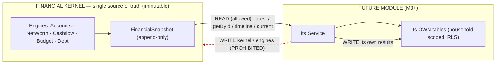

# Life Capital OS V2 — Future Module Contract

> **Normative contract.** This document defines **exactly what every future module may READ from the Financial
> Snapshot and what it is PROHIBITED from WRITING**, so the **Financial Kernel remains the single immutable
> source of truth**. It is binding on all Module 3+ work. Keywords **MUST / MUST NOT / MAY** are used in the
> RFC-2119 sense. Companion: [`FINANCIAL_KERNEL_ARCHITECTURE.md`](./FINANCIAL_KERNEL_ARCHITECTURE.md),
> [`EXTENSION_GUIDELINES.md`](./EXTENSION_GUIDELINES.md), [`ADR-FINANCIAL-KERNEL.md`](./ADR-FINANCIAL-KERNEL.md).

## 0. The one-sentence contract

> A future module **reads consolidated financial truth only from Financial Snapshots**, **writes only into its
> own household-scoped tables**, and **never mutates the kernel or any M2 engine data**.

---

## 1. READ contract — what a module MAY read

A module **MUST** obtain all consolidated financial figures through the kernel read API on
`HouseholdFinancialSnapshotService` (household-scoped, `HouseholdScopeGuard`-gated):

| Read method | Returns | Use |
| --- | --- | --- |
| `latest(householdId)` | latest **`active`** stored snapshot (envelope + payload) | the current canonical position |
| `getById(householdId, id)` | a specific stored snapshot | pinned / historical analysis, AI grounding |
| `timeline(householdId)` | envelopes + headline figures, oldest→newest | trends, forecasting series |
| `current(householdId, …)` | **live composed preview** (never persisted) | "what would a snapshot look like now" — **not** an auditable record |

### 1.1 Readable envelope fields (metadata)
`id`, `householdId`, `entityId`, `capturedAt`, `snapshotVersion`, **`schemaVersion`** (pin to this),
`engineVersion`, `fxVersion`, `currency` (household base), `generatedBy`, `checksum`, `status`, `provenance`.

### 1.2 Readable payload fields (`schemaVersion 1`) — the **entire** allowlist
All monetary values are **base-currency minor units**. A module **MAY** read any of:

- `netWorth` → `assetsMinor, liabilitiesMinor, netWorthMinor, solvencyRatio`
- `assets[]` / `liabilities[]` → `accountId, name, assetClass?, entityId?, nativeCurrency, nativeBalanceMinor, baseBalanceMinor`
- `debt` → `totalOutstandingMinor, totalMonthlyPaymentMinor, weightedAvgRatePct, debtCount, byType[]`
- `cashflowSummary` → `period, incomeMinor, expenseMinor, netMinor, savingsRate, byCategory[]`
- `budgetSummary` → `period, exists, totalBudgetMinor, totalSpentMinor, overTotal`
- `assetAllocation[]` → `assetClass, baseValueMinor, pct`
- `currencyExposure[]` → `currency, baseValueMinor, pct`
- `householdEquity` → `netWorthMinor, totalDebtMinor, reconciledEquityMinor`
- `entityHoldings[]` → `entityId, assetsMinor, liabilitiesMinor, debtOutstandingMinor, netMinor`
- `relationships` → `memberCount, entityCount, entityIds[], accountIds[]`

### 1.3 Read rules
- A module **MUST** treat every read as **read-only** — the payload is an immutable value object.
- A module **MUST** record which `snapshotId` it used when the output is persisted or shown (reproducibility).
- A module **MUST** honor `schemaVersion` (branch on it or up-convert via `upgradePayload`); it **MUST NOT**
  assume fields from a newer version exist on an older snapshot.
- A module **SHOULD** prefer **stored** snapshots (`latest`/`getById`) for anything auditable; `current` is a
  live preview only.

---

## 2. WRITE contract — what a module MUST NOT write

To keep the kernel the single immutable source of truth, a future module **MUST NOT**:

1. **MUST NOT** insert, update, or delete `FinancialSnapshot` rows. Snapshot capture is **exclusively** the
   kernel's (`HouseholdFinancialSnapshotService.capture`, an OWNER/ADVISOR/SUPPORT action). A module never
   "adds to" or "corrects" a snapshot.
2. **MUST NOT** mutate any M2 engine data — `Account`, `Transaction`, `Budget`, `BudgetLine`, `Debt`,
   `DebtPayment`, `NetWorthSnapshot`, `DebtSnapshot`. Those belong to their owning engines and represent
   recorded financial facts.
3. **MUST NOT** write into, or alongside, a snapshot's `payload` (no side tables that shadow/override payload
   fields; no denormalized copies presented as truth).
4. **MUST NOT** re-derive consolidated figures from raw tables (`Account`/`Transaction`/`Debt`) to bypass the
   snapshot — even read-only. All consolidated truth comes from the kernel.
5. **MUST NOT** perform FX conversion of stored figures itself — snapshot figures are already in the base
   currency. (New raw inputs a module stores follow the M2 rule: native at rest, convert via `FxService` in the
   domain layer.)
6. **MUST NOT** downgrade tenancy — every write is household-scoped under `HouseholdScopeGuard`, gated
   `@FirmRoles(OWNER, ADVISOR, SUPPORT)`, and audited.

## 3. WRITE contract — what a module MAY write

A future module **MAY**, and normally **MUST**, own its results in **its own** storage:

- **MAY** create **new** household-scoped tables for its inputs, assumptions, and results (e.g.
  `RetirementPlan`, `Goal`, `InsurancePolicy`, `FinancialHealthScore`, `Scenario`). New tables **MUST** be
  additive (ADR-010) and **MUST** carry **RLS lockdown**.
- **MAY** store a **reference** to the snapshot it was computed from (`snapshotId`) — a pointer, never a copy
  of the payload presented as truth.
- **MAY** store its own **raw inputs** in native currency (converting via `FxService` in the domain layer, per
  ADR-003) when it introduces new financial facts not owned by an M2 engine.
- **MAY** expose its own household-scoped read/write API and its own UI page — mirroring the M2 engine shape.

## 4. Extending the snapshot itself (the only sanctioned way to add fields)

If a module needs a consolidated field the payload lacks, it **MUST** extend the **contract**, not reach around
it:

1. Add an **optional** field to `FinancialSnapshotPayload` (`@lcos/core`).
2. Populate it in `HouseholdFinancialSnapshotService.compose()` by composing an existing engine/service (or a
   new engine the module adds) — **never** by re-aggregating raw tables the kernel already summarizes.
3. If the change is breaking, bump `FINANCIAL_SNAPSHOT_SCHEMA_VERSION` and add an `upgradePayload` entry;
   **never** rewrite stored snapshots.
4. Add core + e2e tests (canonical serialization + composition + reproducibility) and document the field in
   `M2_FINANCIAL_SNAPSHOT_CONTRACT.md` §3.

This keeps every consumer safe (old snapshots unchanged) and the kernel authoritative.

## 5. Enforcement

- **Structural.** A module's service depends on `HouseholdFinancialSnapshotService` (reads) + its own
  repository — **not** on `HouseholdAccounts/Cashflow/Debt` repositories. Reviewable in DI wiring.
- **Guarded.** All routes under `HouseholdScopeGuard`; writes `@FirmRoles(OWNER, ADVISOR, SUPPORT)`; reads
  respect firm-wide (OWNER/ANALYST) vs assigned (ADVISOR/SUPPORT) scope; out-of-scope → 404.
- **Immutable at rest.** `FinancialSnapshot` has no update/delete service path; RLS lockdown closes the
  PostgREST surface; the checksum makes any out-of-band mutation detectable.
- **Audited.** Every module mutation writes an append-only `AuditLog`.

## 6. Compliance checklist for a new module (PR gate)

- [ ] Reads consolidated figures **only** via `FinancialSnapshotService` (no raw-table aggregation).
- [ ] Writes **only** into its own additive, RLS-locked, household-scoped tables.
- [ ] Does **not** touch `FinancialSnapshot` or any M2 engine table.
- [ ] Stores `snapshotId` references (not payload copies) where results are persisted.
- [ ] Any new consolidated field added via an **additive** payload change + `schemaVersion` discipline.
- [ ] Routes guarded + role-gated + audited; multi-currency handled in the domain layer only.
- [ ] Core math is pure `@lcos/core` with tests; e2e covers scope/role + reproducibility.
