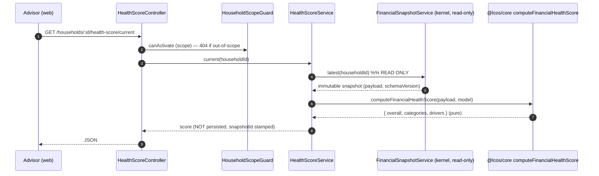
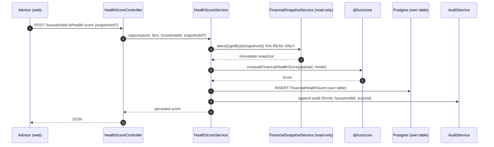

# M3 — Financial Health Score — Design

> **Status:** Proposed (design only — **no production code**). Awaiting architecture review before
> implementation. **Module:** M3-1 (the first consumer of the Financial Kernel). **Depends on:** M2-6
> Financial Snapshot (read-only). **Governed by:** [`FUTURE_MODULE_CONTRACT.md`](./FUTURE_MODULE_CONTRACT.md),
> [`KERNEL_GOVERNANCE.md`](./KERNEL_GOVERNANCE.md). **Reads only immutable Financial Snapshots; mutates nothing
> in the kernel.**

## 1. Objectives

- Give each household a single, explainable **Financial Health Score (0–100)** plus category sub-scores, derived
  **only** from an immutable Financial Snapshot.
- **Validate the kernel contract end-to-end** with the smallest possible surface — the recommended first M3
  module (per the pre-M3 review).
- Be **explainable, reproducible, and deterministic**: the same snapshot + score-model version always yields
  the same score, with plain-language reasons and improvement suggestions.
- Establish the **reusable pattern** every later analysis module (retirement, tax, risk, AI) follows: read a
  snapshot, compute in `@lcos/core`, store results in the module's own tables, never touch the kernel.

## 2. Functional requirements

- FR-1 Compute an overall score (0–100) and a **band** (At Risk / Needs Attention / Fair / Good / Excellent)
  for a household from a snapshot.
- FR-2 Break the score into **weighted categories**, each with its own sub-score, band, driver metric, reason,
  and suggestion.
- FR-3 Compute against the **latest** snapshot or a **specific `snapshotId`** (pinned/historical).
- FR-4 Provide a **live preview** (compute from the latest snapshot, not persisted) and a **persist** action
  (store a score tied to a `snapshotId`).
- FR-5 Provide a **timeline** of persisted scores for trend display.
- FR-6 Stamp every score with `snapshotId`, `schemaVersion`, and `scoreModelVersion` for reproducibility.
- FR-7 Minimal UI: a score gauge + category breakdown + history, in the advisor workspace.

## 3. Non-functional requirements

- NFR-1 **Immutability of the kernel** — reads snapshots only; **no** writes to `FinancialSnapshot` or any M2
  engine table (G-2/G-4).
- NFR-2 **Determinism/reproducibility** — pure scoring function of `(payload, scoreModelVersion)`; no clocks,
  randomness, or live-table reads inside scoring.
- NFR-3 **Explainability** — every sub-score carries the metric value, the thresholds applied, and a
  human-readable reason + suggestion.
- NFR-4 **Tenant isolation & RBAC** — household-scoped under `HouseholdScopeGuard`; read for any in-scope
  member; **persist** gated `OWNER/ADVISOR/SUPPORT`; audited.
- NFR-5 **Performance** — score computation is O(payload size), in-memory, < 5 ms typical; reads are indexed.
- NFR-6 **Multi-currency-agnostic** — consumes base-currency figures from the snapshot; performs **no** FX.
- NFR-7 **Versioned model** — scoring weights/anchors live in a versioned `scoreModelVersion`; tuning is a
  reviewable change, not a silent one.
- NFR-8 **Backward compatible / additive** — new table(s) with RLS lockdown; no kernel change (schemaVersion 1
  already provides every input).

## 4. Inputs

**Only** the Financial Snapshot payload (`schemaVersion 1`), read via `FinancialSnapshotService`:

| Category | Payload fields consumed |
| --- | --- |
| Net Worth & Solvency | `netWorth.netWorthMinor`, `netWorth.solvencyRatio`, `householdEquity.reconciledEquityMinor` |
| Savings | `cashflowSummary.savingsRate`, `cashflowSummary.incomeMinor`, `cashflowSummary.netMinor` |
| Debt Burden | `debt.totalOutstandingMinor`, `debt.totalMonthlyPaymentMinor`, `debt.weightedAvgRatePct`, `netWorth.assetsMinor`, `cashflowSummary.incomeMinor` |
| Emergency Liquidity | `assets[]` where `assetClass = 'cash'` (`baseBalanceMinor`), `cashflowSummary.expenseMinor` |
| Diversification | `assetAllocation[]` (`pct`), `currencyExposure[]` (concentration, secondary) |

Envelope inputs: `currency` (display), `schemaVersion` (guard/branch), `snapshotId`/`capturedAt` (provenance).
**No PII** is consumed. No additional payload fields are required — **fully supported by `schemaVersion 1`.**

## 5. Outputs

```jsonc
{
  "householdId": "…",
  "snapshotId": "…",            // the immutable input (reproducibility)
  "schemaVersion": 1,
  "scoreModelVersion": "fhs-1.0.0",
  "currency": "INR",
  "computedAt": "2026-07-15T…Z",
  "overall": 78,               // 0..100
  "band": "good",              // at_risk|needs_attention|fair|good|excellent
  "categories": [
    {
      "key": "savings",
      "label": "Savings",
      "weight": 20,            // % of overall
      "score": 75,             // 0..100 sub-score
      "band": "good",
      "metric": { "name": "savingsRate", "value": 0.22, "unit": "ratio" },
      "reason": "You save 22% of income, above the 20% healthy threshold.",
      "suggestion": "Push toward 30% to reach an excellent savings position."
    }
    // … one per category
  ],
  "drivers": { "top": ["debt_burden"], "weakest": ["diversification"] }
}
```

## 6. Financial Health Score methodology

- **Weighted composite.** `overall = round( Σ (categoryScore_i × weight_i) / Σ weight_i )`. Weights sum to 100.
- **Category weights (`fhs-1.0.0`, configurable per model version):**
  Net Worth & Solvency **25** · Debt Burden **25** · Savings **20** · Emergency Liquidity **20** ·
  Diversification **10**.
- **Metric → sub-score** via a **documented, monotonic, piecewise-linear** map between anchor points (so every
  score is explainable and tunable without code — anchors live in the versioned model). Examples (`fhs-1.0.0`):
  - **Savings rate:** 0%→0, 10%→50, 20%→75, ≥30%→100.
  - **Debt-to-income (DTI = monthly debt ÷ monthly income):** ≤0→100, 0.20→75, 0.36→50, ≥0.50→0 (inverse).
  - **Debt-to-assets:** 0→100, 0.30→70, 0.50→50, ≥0.80→0 (inverse).
  - **Emergency liquidity (months of expenses in cash):** 0→0, 3→60, 6→90, ≥9→100.
  - **Solvency (net worth positivity + `solvencyRatio`):** negative net worth→0; ratio 1.0→40, 2.0→70, ≥4.0→100.
  - **Diversification (`1 − HHI` over `assetAllocation.pct`):** single class→low, evenly spread→high (mapped 0→0, 0.5→60, ≥0.75→100).
  - *Debt Burden* combines DTI and Debt-to-assets (mean); *Emergency Liquidity* uses months-of-expenses.
- **Overall band:** 0–39 At Risk · 40–59 Needs Attention · 60–74 Fair · 75–89 Good · 90–100 Excellent.
- **Edge handling:** zero income → savings/DTI sub-scores use documented fallbacks (e.g. DTI undefined → score
  from debt-to-assets only); no assets → diversification neutralized (excluded, weights renormalized). All
  fallbacks are documented in the model and covered by tests.

## 7. Explainable scoring model

Every sub-score is a **transparent function**, never a black box:

- **Inputs shown:** the exact metric value used (e.g. `savingsRate = 0.22`) and its source payload field.
- **Rule shown:** the anchor thresholds applied (from `scoreModelVersion`), so a reviewer can trace the number.
- **Reason:** a templated plain-language sentence (`"You save 22% of income, above the 20% healthy
  threshold."`).
- **Suggestion:** a concrete, monotonic next step (`"Push toward 30% …"`).
- **Reproducible & comparable:** `scoreModelVersion` is stamped; two scores are comparable only within the same
  model version (a model change is a new version, old scores keep their version — mirrors snapshot
  `schemaVersion` discipline).
- **No hidden state:** the function is pure over the snapshot payload; there is no "learned" or time-dependent
  component in v1 (any future ML factor would be an explicit, versioned, explainable addition).

## 8. Category definitions

| Key | Label | What it measures | Primary metric(s) | Weight |
| --- | --- | --- | --- | --- |
| `net_worth` | Net Worth & Solvency | Positive, resilient balance sheet | `solvencyRatio`, net-worth sign, `reconciledEquity` | 25 |
| `debt_burden` | Debt Burden | Sustainable leverage & repayment load | DTI, debt-to-assets, `weightedAvgRatePct` | 25 |
| `savings` | Savings | Surplus generation | `savingsRate` | 20 |
| `liquidity` | Emergency Liquidity | Months of expenses in accessible cash | cash assets ÷ monthly expense | 20 |
| `diversification` | Diversification | Concentration risk across asset classes | `1 − HHI` of `assetAllocation.pct` | 10 |

*(Currency concentration from `currencyExposure` is a documented secondary signal within Diversification,
promotable to its own weighted category in a future `scoreModelVersion` — see §15.)*

## 9. API contracts

Household-scoped under `HouseholdScopeGuard`; reads for any in-scope member; **persist** gated
`@FirmRoles(OWNER, ADVISOR, SUPPORT)`; audited. Additive routes, versioned by `scoreModelVersion` in the body.

| Method & path | Purpose | Roles |
| --- | --- | --- |
| `GET /households/:id/health-score/current` | Live compute from the **latest** snapshot (not persisted). Optional `?snapshotId=`. | in-scope member |
| `POST /households/:id/health-score` | Compute for the latest (or body `snapshotId`) and **persist** a score row. | OWNER/ADVISOR/SUPPORT |
| `GET /households/:id/health-score/latest` | Latest persisted score. | in-scope member |
| `GET /households/:id/health-score/timeline` | Persisted scores oldest→newest (trend). | in-scope member |
| `GET /households/:id/health-score/:scoreId` | A specific persisted score. | in-scope member |

Every response includes `snapshotId`, `schemaVersion`, `scoreModelVersion`, `currency`, `computedAt`.
**404-not-403** for out-of-scope households. If no snapshot exists yet, `current` returns a documented
`{ available: false, reason: "no snapshot captured" }` (the UI prompts to capture one first).

## 10. UI wireframes

Route: `/app/households/[id]/health-score` (advisor workspace; presentation-only, composes `@/ui`).

```
┌──────────────────────────────────────────────────────────────┐
│ ◂ Back to household        Financial Health   [INR]          │
│ The Sharmas · as of 15 Jul 2026 (snapshot #4)   [Recompute]  │
├──────────────────────────────────────────────────────────────┤
│              ╭───────────╮                                    │
│              │    78     │   GOOD        Top driver: Debt     │
│              │  / 100    │               Weakest: Diversify   │
│              ╰───────────╯                                    │
├──────────────────────────────────────────────────────────────┤
│ Category            Score  Band     Why                       │
│ ───────────────────────────────────────────────────────────  │
│ Net Worth & Solvency  82   Good     Assets 3.1× liabilities   │
│ Debt Burden           88   Excellent DTI 0.14, low leverage   │
│ Savings               75   Good     Saves 22% of income       │
│ Emergency Liquidity   70   Fair     4.1 months of expenses    │
│ Diversification       55   Needs…   68% concentrated in equity│
├──────────────────────────────────────────────────────────────┤
│ Suggestions:                                                  │
│  • Add ~2 months of cash to reach a 6-month buffer.           │
│  • Trim equity toward target; add debt/gold for balance.      │
├──────────────────────────────────────────────────────────────┤
│ History  ▁▂▃▅▆▇  (score over captured snapshots)              │
└──────────────────────────────────────────────────────────────┘
```

Empty state (no snapshot): "Capture a Financial Snapshot first" → links to the snapshot page. Loading/error
states as elsewhere. **No score math in the browser** — it renders the API result.

## 11. Sequence diagrams

**Live preview (`GET …/health-score/current`):**



**Persist (`POST …/health-score`):**



## 12. Data flow

```mermaid
flowchart LR
  Snap["Immutable FinancialSnapshot<br/>(kernel, read-only)"] -->|payload| HS["HealthScoreService"]
  HS -->|pure fn| Core["@lcos/core<br/>computeFinancialHealthScore(payload, model)"]
  Core -->|score + explanations| HS
  HS -->|persist (own table)| DB[("FinancialHealthScore")]
  HS -->|read| DB
  HS --> API["/households/:id/health-score/*"]
  API --> UI["/app/.../health-score (presentation)"]
  HS -. "MUST NOT write" .-> Snap
  linkStyle 7 stroke:#c00,stroke-dasharray:5 5
```

**Own storage (additive, RLS-locked, household-scoped):** `FinancialHealthScore` — `id, householdId, firmId,
snapshotId, schemaVersion, scoreModelVersion, overall, band, categories(Json), drivers(Json), currency,
computedById, computedAt`. Indexes `(householdId, computedAt)`, `(firmId)`, `(snapshotId)`. **No** kernel or
engine table is written.

## 13. Performance expectations

- Scoring is a **pure O(payload)** in-memory computation — target **< 5 ms**; no DB access inside the pure
  function.
- `current` = one snapshot read + compute; `latest`/`:id` = one indexed row; `timeline` = one indexed range
  read (add `skip/take` when histories grow).
- No FX, no re-aggregation, no N+1. Heavy/scheduled scoring (e.g. batch re-score on a new snapshot) is a future
  M0-worker concern, off the request path.
- Scores are cheap to recompute deterministically, so caching is optional; persistence is for **history/trend**,
  not to avoid cost.

## 14. Testing strategy

- **Core (`@lcos/core`) unit tests:** the pure `computeFinancialHealthScore` — anchor-point mappings,
  weighting, band boundaries, monotonicity (more savings never lowers the savings sub-score), and edge cases
  (zero income, no assets, negative net worth). Deterministic, no IO.
- **API e2e:** scope/role gating (outsider 404, analyst read-only, persist requires OWNER/ADVISOR/SUPPORT);
  `current` vs persisted; **reproducibility** (same snapshot ⇒ identical score); "no snapshot yet" path;
  multi-currency (score identical regardless of base currency for equivalent positions, since inputs are
  base-normalized).
- **Contract test:** the service reads **only** `FinancialSnapshotService` (never engine repos) — enforced by
  DI wiring and asserted in review.
- **Web:** `tsc`/build green; renders API result; no math in the browser.
- **Health suite:** `migrate reset`+`diff` (no drift, one additive table), build 3/3, lint 4/4, core + e2e
  green.

## 15. Extension points

The Financial Health Score is the **template** for every later analysis module; the design is deliberately
generalizable so future modules plug in **without redesigning the kernel**:

- **Versioned score model (`scoreModelVersion`)** — new weights/anchors, or new categories (e.g. **currency
  risk**, **insurance adequacy** once that module exists), ship as a new model version; old scores keep theirs.
- **New categories from additive payload fields** — when Retirement/Insurance add the `members[]` demographic
  field (additive `schemaVersion`), an **age-appropriateness** category can be added — still snapshot-only.
- **Reused by downstream modules (all snapshot consumers, no kernel change):**
  - **AI Wealth Advisor** — narrates the score + drivers from the same snapshot.
  - **Family Office Dashboard** — surfaces the overall score + trend tile.
  - **Retirement / Goal / Tax / Estate / Insurance** — reuse the sub-score metrics (savings, liquidity,
    leverage) as planning inputs.
  - **Forecasting / Monte Carlo / What-if** — project the score forward from a base snapshot; scenarios never
    mutate the snapshot.
- **Pattern to copy:** read snapshot → pure `@lcos/core` computation → own additive RLS-locked table →
  household-scoped guarded API → presentation-only UI. This is the reusable M3+ blueprint.

> **Kernel guarantee restated:** this module reads immutable Financial Snapshots only, performs no FX, writes
> only its own table, and never mutates the Financial Kernel (G-1…G-6). `schemaVersion 1` already supplies every
> input — **no kernel change is required to ship the Financial Health Score.**
