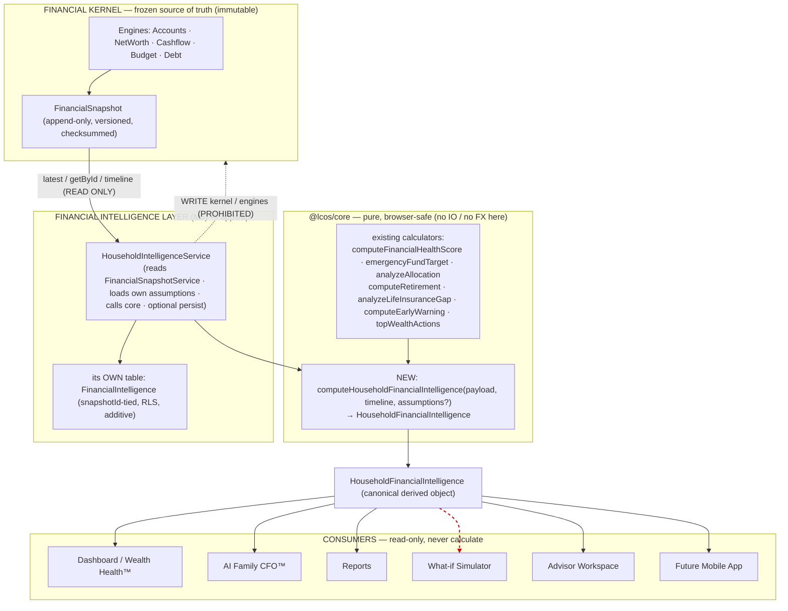
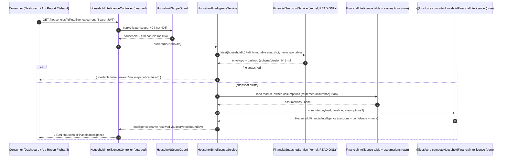
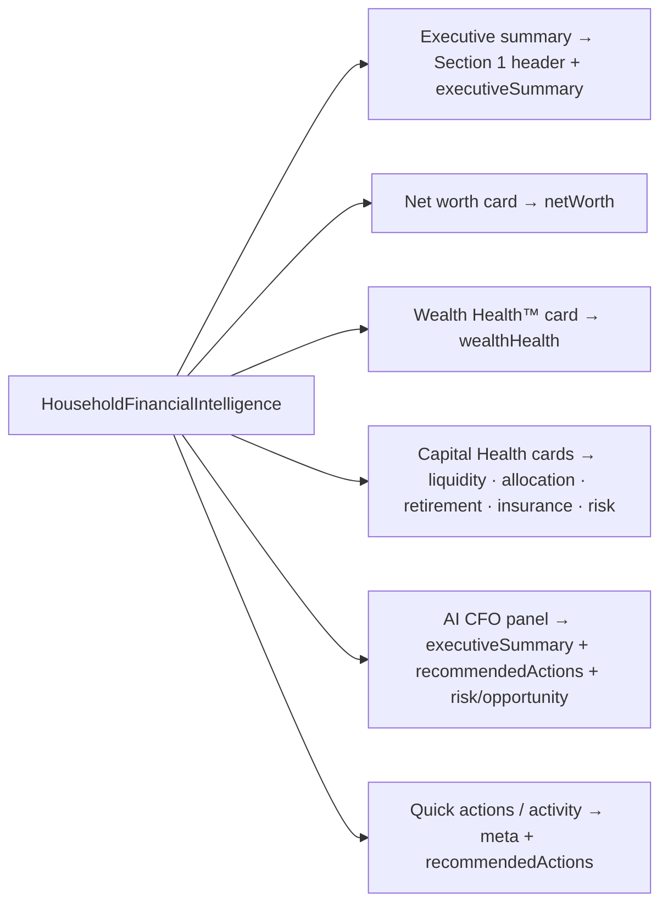
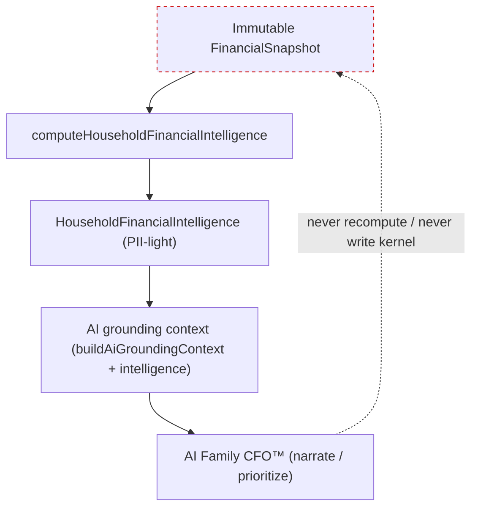

# M5 — Financial Intelligence Layer — Design

> **Status:** Proposed (design only — awaiting approval before any code). **Module:** M5 (Financial
> Intelligence Layer). **Depends on:** the frozen Financial Kernel (M2-6 `FinancialSnapshot`), M3-1 Health
> Score, and the pure `@lcos/core` calculators. **Constraints:** the **Financial Kernel remains immutable**;
> this layer is a **derived read-model** that **reads snapshots only**, **writes only its own additive,
> RLS-locked table(s)**, does **no FX**, and adds **no kernel/ADR/schema change** and **no renamed exports**.
> Companion: [`KERNEL_GOVERNANCE`](./KERNEL_GOVERNANCE.md), [`FUTURE_MODULE_CONTRACT`](./FUTURE_MODULE_CONTRACT.md),
> [`FINANCIAL_KERNEL_ARCHITECTURE`](./FINANCIAL_KERNEL_ARCHITECTURE.md),
> [`AI_INTEGRATION_ARCHITECTURE`](./AI_INTEGRATION_ARCHITECTURE.md),
> [`AI_GROUNDING_CONTRACT`](./AI_GROUNDING_CONTRACT.md), [`M4_DASHBOARD_FOUNDATION`](./M4_DASHBOARD_FOUNDATION.md).

---

## 1. Vision

> **The Financial Kernel is the single source of truth for financial _facts_. The Financial Intelligence Layer
> becomes the single source of truth for financial _intelligence_ — the derived, explainable, decision-ready
> view of a family's finances. One calculation. Many consumers.**

Today, derived understanding is scattered: the Dashboard (M4) wires several reads and shows placeholder score
cards; M3-1 computes a Health Score; the AI CFO is a placeholder; What-if, Reports, and the Advisor Workspace
would each need the same figures. Left unchecked, every module re-derives liquidity, allocation, risk, and
readiness its own way — divergent numbers, divergent narratives, duplicated bugs.

M5 collapses that into **one canonical derived object** — `HouseholdFinancialIntelligence` — computed **once**
from an immutable Financial Snapshot and consumed **read-only** by every surface. A number shown on the
Dashboard, cited by the AI Family CFO™, printed in a Report, and seeded into a What-if is **the same number,
computed the same way, traceable to the same `snapshotId`**.

This is deliberately the mirror of the kernel's own contract, one level up:

| | Source of truth for… | Written by | Read by |
| --- | --- | --- | --- |
| **Financial Kernel** (M2-6) | consolidated **facts** (net worth, debt, cashflow, allocation…) | the engines (capture) | the Intelligence Layer + any consumer |
| **Financial Intelligence Layer** (M5) | derived **intelligence** (scores, gaps, risks, opportunities, narrative, actions) | this layer (compose) | Dashboard · Wealth Health™ · AI CFO™ · Reports · What-if · Advisor Workspace · Mobile |

## 2. Goals

**In scope**

1. Define the canonical `HouseholdFinancialIntelligence` object (§4) — the versioned, PII-light, base-currency
   contract every consumer depends on.
2. Compute it **purely** in `@lcos/core` (`computeHouseholdFinancialIntelligence(...)`) by **composing the
   calculators that already exist** — no new financial math is invented in M5; it orchestrates
   `computeFinancialHealthScore`, `emergencyFundTarget`, `analyzeAllocation`, `computeRetirement`,
   `analyzeLifeInsuranceGap`, `computeEarlyWarning`, `topWealthActions`, and the FX-free snapshot aggregates.
3. Expose it through a thin, guarded NestJS service that **reads snapshots only** and mirrors the proven
   `HouseholdHealthScoreService` shape (`current` live preview · `capture` + `latest`/`timeline`/`:id`
   persisted, each tied to a `snapshotId`).
4. Make it **explainable and reproducible**: every section records what it used, a confidence, and the
   `snapshotId`/versions it was derived from; the same snapshot always yields the same intelligence.
5. Make it **degrade gracefully**: sections whose inputs are missing (no snapshot, no retirement assumptions,
   no insurance policies) report `available: false` with a reason — never fabricated numbers.
6. Give every current and future consumer **one object to read** so no consumer ever performs business
   calculations again.

**Explicit non-goals**

- **No** change to the Financial Kernel, its engines, the `FinancialSnapshot` payload/`schemaVersion 1`, any
  ADR, or the DB shape of any M2/M3 table (governance G-1…G-6).
- **No** re-aggregation of raw `Account`/`Transaction`/`Debt` tables; **no** FX in this layer.
- **No** AI model calls in the layer itself — M5 produces the *grounding-ready* intelligence; the AI fleet
  (separate module) consumes it.
- **No** new UI in this milestone beyond what a follow-up wires; M5 is the **engine + contract**. (The M4
  Dashboard is the first consumer and already has the `ScoreCard` seam waiting.)
- **No** renamed/removed exports anywhere.

## 3. Architecture

The layer sits **between** the frozen kernel and every consumer. It is the only place derived intelligence is
produced; consumers never compute.



**Placement rationale**

- The **canonical object type and the composition function live in `@lcos/core`** (pure, browser-safe) so the
  web app, a future mobile app, and the AI layer all share **one** type and **one** implementation — no drift.
- The **NestJS service is thin**: resolve the immutable snapshot (read-only via `FinancialSnapshotService`),
  load any module-owned assumptions from its own table, call the pure core function, optionally persist. It is
  a **snapshot consumer**, structurally identical to `HouseholdHealthScoreService` (M3-1) — the pattern the
  `FUTURE_MODULE_CONTRACT` already blesses.
- **No FX, ever**: snapshot figures are already consolidated in the household base currency; the layer only
  reads them. Any module-owned raw input (e.g. an insurance premium) is stored native and converted via
  `FxService` in the domain layer before it reaches the pure function — never inside `@lcos/core`.

**Two compute modes** (mirrors the kernel's `current` vs captured snapshot):

- **`current` (live preview):** compose from the latest (or a given) immutable snapshot; **not persisted**.
  Cheap, always fresh, ideal for the Dashboard. Returns `{ available: false }` when no snapshot exists.
- **`capture` (materialized):** compute and **persist** a `FinancialIntelligence` row tied to a `snapshotId`
  (immutable, reproducible, cacheable, audit-logged). `latest`/`timeline`/`:id` read persisted rows verbatim.
  This gives Reports and audits a stable, citeable artifact and lets hot dashboards read O(1).

## 4. The canonical object — `HouseholdFinancialIntelligence`

Defined in `packages/core/src/finance/financialIntelligence.ts` (pure). **All monetary values are
base-currency minor units** (same convention as the snapshot). **PII-light**: ids and coarse demographics only
— never names/DOB/taxIds (ADR-006), so the object is safe to hand to the AI grounding layer and to serialize
to any client. Every section carries an `available` flag + `confidence` so consumers degrade gracefully.

```ts
export const FINANCIAL_INTELLIGENCE_SCHEMA_VERSION = 1;
export const FINANCIAL_INTELLIGENCE_ENGINE_VERSION = 'm5-fil-1.0.0';

/** Uniform wrapper: every section is either available (with data) or explains why not. */
export type Section<T> =
  | { available: true; confidence: Confidence; data: T }
  | { available: false; reason: string };

export type Confidence = 'high' | 'medium' | 'low';
export type Band = 'at_risk' | 'needs_attention' | 'fair' | 'good' | 'excellent'; // reuse HealthBand
export type Trend = 'up' | 'down' | 'flat' | 'unknown';
export type Severity = 'low' | 'medium' | 'high' | 'critical';
export type StatusLight = 'green' | 'yellow' | 'red';

export interface HouseholdFinancialIntelligence {
  // 1. Household Summary — ids + counts + coarse demographics only (no PII)
  household: {
    householdId: string;
    name: string | null;          // resolved by the API layer through the decrypted boundary; null in core/AI use
    baseCurrency: string;
    members: { memberId: string; ageYears: number | null; isDependent: boolean; relation: string }[];
    memberCount: number;
    entityCount: number;
    lastUpdated: string;          // snapshot capturedAt
  };

  // 2. Net Worth Intelligence
  netWorth: Section<{
    assetsMinor: number;
    liabilitiesMinor: number;
    netWorthMinor: number;
    solvencyRatio: number;
    trend: Trend;                 // from timeline() series
    changeMinor: number | null;   // vs previous snapshot
    changePct: number | null;
  }>;

  // 3. Liquidity Intelligence
  liquidity: Section<{
    cashMinor: number;            // assets with assetClass === 'cash'
    emergencyFundMinor: number;   // liquid buffer
    monthlyExpensesMinor: number;
    monthsCovered: number;        // emergencyFundTarget()
    targetMonths: number;         // default 6
    status: StatusLight;
  }>;

  // 4. Asset Allocation Intelligence
  allocation: Section<{
    current: { assetClass: string; pct: number; baseValueMinor: number }[];
    diversificationIndex: number; // 1 - HHI
    topConcentration: { assetClass: string; pct: number } | null;
    concentrationRisk: StatusLight;
    drift: { assetClass: string; driftPct: number }[] | null; // vs recommended, when a risk profile exists
    suggestions: string[];
  }>;

  // 5. Retirement Intelligence (needs member ages [in payload] + assumptions [module-owned])
  retirement: Section<{
    currentCorpusMinor: number;
    requiredCorpusMinor: number;
    fundingGapMinor: number;
    readinessPct: number;         // secured share of required corpus
    onTrack: boolean;
    monthlySipRequiredMinor: number;
    assumptionsVersion: string;   // which assumption set was used
  }>;

  // 6. Insurance Intelligence (needs income/liabilities [snapshot] + existing cover [module-owned])
  insurance: Section<{
    recommendedCoverMinor: number;
    existingCoverMinor: number;
    protectionGapMinor: number;
    adequate: boolean;
    status: StatusLight;
    dependents: number;
  }>;

  // 7. Cash Flow Intelligence
  cashflow: Section<{
    period: string;
    incomeMinor: number;
    expenseMinor: number;
    netMinor: number;
    savingsRate: number;
    status: StatusLight;          // surplus / tight / deficit
    topCategories: { category: string; amountMinor: number }[];
  }>;

  // 8. Risk Intelligence (computeEarlyWarning over snapshot-derived inputs)
  risk: Section<{
    topRisks: { key: string; label: string; severity: Severity; detail: string }[];
    overall: StatusLight;
    redCount: number;
    yellowCount: number;
  }>;

  // 9. Opportunity Intelligence
  opportunity: Section<{
    quickWins: { key: string; title: string; rationale: string; estimatedImpact: Severity }[];
    longTerm: { key: string; title: string; rationale: string; estimatedImpact: Severity }[];
  }>;

  // 10. Wealth Health™ (computeFinancialHealthScore — M3-1, reused verbatim)
  wealthHealth: Section<{
    overall: number;              // 0..100
    band: Band;
    category: string;             // human label of the band, e.g. "Good"
    categories: { key: string; label: string; score: number; band: Band; weight: number }[];
    confidence: Confidence;
    trend: Trend;                 // from health-score timeline / recomputed series
  }>;

  // 11. Executive Summary — human-readable, dashboard-ready (deterministic, template-composed; NOT an LLM call)
  executiveSummary: {
    headline: string;             // e.g. "Financially healthy with a retirement gap to close."
    paragraphs: string[];
    highlights: string[];         // 2–4 bullet strengths
    watchouts: string[];          // 2–4 bullet concerns
  };

  // 12. Recommended Next Actions — prioritized, cross-section
  recommendedActions: {
    priority: number;
    title: string;
    rationale: string;
    sourceSection: string;        // which intelligence section raised it
    estimatedImpact: Severity;
  }[];

  // 13. Metadata
  meta: {
    schemaVersion: number;        // FINANCIAL_INTELLIGENCE_SCHEMA_VERSION
    engineVersion: string;        // FINANCIAL_INTELLIGENCE_ENGINE_VERSION
    scoreModelVersion: string;    // FINANCIAL_HEALTH_MODEL_VERSION reused
    snapshotId: string;           // the immutable snapshot this was derived from
    snapshotSchemaVersion: number;
    fxVersion: string;            // carried from the snapshot (provenance only; no FX done here)
    currency: string;
    computedAt: string;
    dataCompleteness: {           // which inputs were present → drives confidence + available flags
      pct: number;                // 0..100
      missing: string[];          // e.g. ["retirementAssumptions", "insurancePolicies"]
    };
  };
}
```

**Design notes**

- **`Section<T>` everywhere** makes "graceful degradation" a type-level guarantee: a consumer must handle
  `available: false`, so a missing retirement assumption can never render a fake corpus.
- **`name` is `null` in the pure/core/AI representation.** The API layer resolves the human label through the
  existing guarded, decrypted boundary (never from the snapshot payload — same rule as M4/AI grounding). This
  keeps the core object and the AI-facing object PII-safe by construction.
- **Executive Summary and Recommended Actions are deterministic**, template-composed from the computed
  sections (like `topWealthActions` / `financialHealthExplanation` already do). They are *grounding-ready* text,
  **not** an LLM call — the AI fleet may rewrite them, but the layer never depends on a model.
- **Versioned like the snapshot**: `FINANCIAL_INTELLIGENCE_SCHEMA_VERSION` is additive-only; new sections/fields
  are optional; a breaking change bumps the version with an up-converter. Consumers pin to it.

## 5. Data Flow



- **Capture path** (`POST /intelligence`) adds: persist a `FinancialIntelligence` row (`snapshotId`,
  `schemaVersion`, `engineVersion`, `computedAt`, the object as JSON, `checksum` optional) → `AuditService`
  append. Reads of persisted rows are **verbatim** (no recompute), exactly like snapshots and health scores.
- **Inputs, precisely:** consolidated figures come **only** from the snapshot payload (net worth, debt,
  cashflow, allocation, currency exposure, equity, `members[]` demographics). Trend comes from
  `FinancialSnapshotService.timeline()`. Retirement/insurance *assumptions and existing policies* — which the
  snapshot does not own — come from the **module's own** additive tables (or sensible documented defaults),
  never from a kernel table.

## 6. Service boundaries

| Concern | Owner | Rule |
| --- | --- | --- |
| Consolidated financial **facts** | Financial Kernel (M2-6) | M5 **reads** via `FinancialSnapshotService.{latest,getById,timeline,current}` **only**. Never writes. Never reads raw `Account`/`Transaction`/`Debt`. |
| Derived **intelligence** math | `@lcos/core` (pure) | `computeHouseholdFinancialIntelligence` composes existing calculators. No IO, clock, randomness, or FX. Fully deterministic + tested. |
| Orchestration + persistence | `HouseholdIntelligenceService` (apps/api) | Thin. Depends on `FinancialSnapshotService` (read) + its **own** repository + `FxService` (only to convert module-owned raw inputs) + `AuditService`. Mirrors `HouseholdHealthScoreService`. |
| Module-owned **inputs** (retirement assumptions, insurance policies) | M5's own tables | Additive, RLS-locked, household-scoped. Native currency at rest; converted in the domain layer. |
| Tenancy / auth | existing platform | Every route under `HouseholdScopeGuard`; writes `@FirmRoles(OWNER, ADVISOR, SUPPORT)`; ANALYST read-only; out-of-scope → 404; every mutation audited. |
| Human labels / PII | existing decrypted boundary | The API layer resolves `household.name` etc.; the pure object + the AI object stay PII-light. |

**Structural enforcement (reviewable in DI):** `HouseholdIntelligenceService`'s constructor injects
`FinancialSnapshotService` + its own Prisma repository — **not** `HouseholdAccounts/Cashflow/Debt` services.
That single wiring fact guarantees "consumes the kernel, never re-aggregates," per `FUTURE_MODULE_CONTRACT` §5.

## 7. Folder structure (additive — mirrors the M2/M3 module shape)

```
packages/core/src/finance/
├─ financialIntelligence.ts            # NEW: canonical object type + computeHouseholdFinancialIntelligence (pure)
│                                       #      composes existing calculators; version constants; up-converter
└─ financialIntelligence.test.ts       # NEW: determinism, degradation (available:false), section correctness

packages/core/src/index.ts             # +export financialIntelligence (additive, no renames)

apps/api/src/households/
├─ household-intelligence.controller.ts # NEW: thin, guarded; current | POST capture | latest | timeline | :id
├─ household-intelligence.service.ts    # NEW: snapshot consumer; mirrors household-health-score.service.ts
├─ household-intelligence.dto.ts        # NEW: assumptions/capture DTOs (class-validator)
└─ households.module.ts                 # register controller + service (additive)

apps/api/prisma/
├─ schema.prisma                        # +FinancialIntelligence (+ optional RetirementAssumption / InsurancePolicy)
└─ migrations/<ts>_add_financial_intelligence/migration.sql  # additive + RLS lockdown on new tables

apps/api/test/
└─ household-intelligence.e2e-spec.ts   # NEW: scope/role, snapshot-only, degradation, reproducibility

apps/web/src/                           # (follow-up consumer wiring — NOT this milestone)
└─ components/dashboard/*               # existing ScoreCard seam swaps placeholders for live sections
```

Nothing under `packages/core` existing files, the kernel service, M2/M3 tables, or `apps/web/src/ui/*` is
modified. New Prisma models are **new tables** with RLS lockdown (governance G-6, ADR-010).

## 8. API contract (all new, household-scoped, guarded; mirrors M3-1)

| Method | Route (`/api/households/:id/intelligence`) | Role | Returns |
| --- | --- | --- | --- |
| `GET` | `/current` | any in-scope | **live** `HouseholdFinancialIntelligence` (not persisted); `{available:false}` if no snapshot |
| `POST` | `` (capture) | OWNER/ADVISOR/SUPPORT | persist intelligence tied to `snapshotId`; audited |
| `GET` | `/latest` | any in-scope | latest **persisted** intelligence (or `null`) |
| `GET` | `/timeline` | any in-scope | persisted headline series (overall score, net worth, computedAt) oldest→newest |
| `GET` | `/:intelligenceId` | any in-scope | a specific persisted intelligence, verbatim |

- Optional `?snapshotId=` on `current`/`POST` pins the computation to a specific immutable snapshot (default:
  latest). Same semantics as `health-score`.
- **No new kernel routes; no mutations to any existing endpoint.** This is purely additive surface.
- Response is the §4 object; `meta.dataCompleteness` and per-section `available` tell the client exactly what to
  render vs. what to prompt for (e.g. "add retirement assumptions to unlock readiness").

## 9. UI consumption

**One fetch replaces many.** The M4 Dashboard currently issues ~5 parallel reads and shows placeholder score
cards. With M5 it issues **one** read — `GET /intelligence/current` — and every card binds to a section of the
returned object. The `ScoreCard` extension seam built in M4 was designed for exactly this: a card flips from
placeholder to live by reading `intelligence.<section>` — **no layout redesign** (M4 §9).



- Consumers **only read**; no consumer computes a score, months-covered, or a gap — those are fields now.
- Placeholder → live is a data change, not a code redesign: unavailable sections keep the tasteful "coming
  soon / add data" state the M4 cards already implement.
- Mobile app (future) consumes the **same** object over the same route — one contract, many clients.

## 10. AI consumption

The AI Family CFO™ **never calculates** — it narrates and prioritizes the intelligence object, and it grounds
per the existing `AI_GROUNDING_CONTRACT`.

- The layer already produces PII-light, aggregate-only sections plus a deterministic `executiveSummary` and
  `recommendedActions`. These are **grounding-ready**.
- For model calls, the AI service builds its grounding context from the **snapshot** via
  `buildAiGroundingContext(envelope, payload)` (unchanged) **and** may attach the M5 intelligence object (which
  is already redacted: ids + coarse demographics only, no names/DOB/taxIds — verifiable with the existing
  `containsNoPiiKeys` guard). The `meta.snapshotId` + versions travel with it, so every AI answer cites "as of
  `capturedAt`, `schemaVersion` N, intelligence `engineVersion` m5-…".
- The AI's role is **rewrite/prioritize/converse**, never recompute. Any AI-suggested change is a
  recommendation surfaced to a human and applied through the normal write path (AI doc §5–§6).



## 11. Extension strategy — new intelligence without touching the kernel

The canonical object is a stable envelope; **sections are pluggable**. New intelligence is added as a **new
optional section** (additive `schemaVersion`), computed by a pure "intelligence provider" that reads the
snapshot (+ the module's own inputs). None of this touches the Financial Kernel.

| Future capability | How it plugs in | Kernel change? |
| --- | --- | --- |
| **Scenario Simulation** | What-if seeds from a snapshot, applies in-memory deltas, then runs the **same** `computeHouseholdFinancialIntelligence` on the mutated payload to get "intelligence after this change." Compare two objects. | **None** — never mutates the base snapshot. |
| **Benchmarking** | New optional `benchmarks` section: compares the object's metrics to cohort data stored in the **module's own** table. | **None** — module-owned reference data. |
| **Family Timeline** | New optional `timelineIntelligence` section built from `FinancialSnapshotService.timeline()` (net worth / score / debt series). | **None** — already-available read. |
| **Notifications** | A watcher diffs successive persisted intelligence rows (e.g. band drop, new red risk) and emits events; reads only M5 output. | **None** — consumes M5, writes its own. |
| **AI Agents (V3)** | Agents consume the intelligence object + grounding context; act via normal guarded write paths. | **None** — read-only grounding. |
| **External APIs** | A public/partner API projects a subset of the object (versioned, PII-light already). | **None** — projection of an existing contract. |
| **Advisor Marketplace** | Third-party modules read the object through the same guarded contract; write only their own tables. | **None** — governed by `FUTURE_MODULE_CONTRACT`. |

**The additive rule (same as the kernel's):** need a new field? Add it **optional** to the object under the same
`schemaVersion`, populate it in the pure composer from an existing snapshot field or a new module-owned input,
and add tests. Breaking? Bump `FINANCIAL_INTELLIGENCE_SCHEMA_VERSION` with an up-converter; never rewrite
persisted rows. If a genuinely new *consolidated fact* is required, it is added to the **snapshot** through the
kernel's own governed, ADR-gated process (G-5) — **not** invented here.

## 12. Risks & mitigations

| Risk | Severity | Mitigation |
| --- | --- | --- |
| **Layer drifts into a second source of truth** (starts holding facts) | High | Hard rule: the object holds **derived** values only; all facts come from the snapshot each compute. Persisted rows are a **cache** keyed by `snapshotId`, never an authority — a corrected snapshot yields a new intelligence row. |
| **Re-aggregating raw tables** to fill a section | High | Structural DI guarantee (only `FinancialSnapshotService` injected); e2e asserts no engine repos used; PR gate checklist. |
| **Missing module-owned inputs → fabricated numbers** (retirement/insurance) | Medium | `Section<T>` forces `available:false` with a reason; `meta.dataCompleteness` surfaces what's missing; consumers prompt to add data. |
| **Stale persisted intelligence** shown as current | Medium | Every persisted row records its `snapshotId`; `latest` compares to the kernel's latest snapshot and flags staleness; `current` recomputes live. |
| **Version skew** across schema / score model / snapshot | Medium | Three versions stamped in `meta` (`schemaVersion`, `engineVersion`, `scoreModelVersion`) + `snapshotId`; consumers pin `schemaVersion`; up-converter presents old rows at the latest shape. |
| **Performance of live compose on hot dashboards** | Low | `current` is O(1) over one snapshot payload (no fan-out to engines); hot paths read **persisted** intelligence (O(1)); capture is on-demand. |
| **PII leakage into AI/clients** | Medium | Core object is PII-light by construction (`name:null`, ids/coarse demographics); `containsNoPiiKeys` guard in tests; labels resolved only through the decrypted API boundary. |
| **Scope creep** (building AI/Reports/What-if in M5) | Medium | M5 ships the **engine + contract + API** only; consumers are separate, later milestones. |
| **Determinism regressions** | Low | Pure core, no clock/random; golden-payload tests assert byte-stable output; reproducibility e2e (same snapshot → identical intelligence). |

## 13. Acceptance criteria (for the eventual implementation PR)

- `computeHouseholdFinancialIntelligence(payload, timeline, assumptions?)` exists in `@lcos/core`, is **pure and
  deterministic** (no IO/clock/random/FX), composes the **existing** calculators, and is covered by unit tests
  for each section, for graceful degradation (`available:false` paths), and for determinism.
- The object matches §4 exactly: 13 sections, base-currency minor units, PII-light, versioned `meta` with
  `dataCompleteness`.
- `HouseholdIntelligenceService` reads consolidated figures **only** via `FinancialSnapshotService`
  (`latest`/`getById`/`timeline`), depends on **no** M2 engine repository, writes **only** its own
  RLS-locked, household-scoped table(s), and audits every mutation.
- Routes (`/current`, `POST`, `/latest`, `/timeline`, `/:id`) are `HouseholdScopeGuard`-gated, role-gated on
  writes, ANALYST read-only, out-of-scope → 404; e2e covers scope/role, snapshot-only sourcing, degradation,
  and reproducibility (same snapshot → identical persisted intelligence).
- **No** change to the Financial Kernel, `FinancialSnapshot` payload, `schemaVersion 1`, any ADR, or the DB
  shape of any existing table; migrations are additive with RLS lockdown and **drift-free** (`migrate reset` +
  `migrate diff`); **no** renamed/removed exports.
- The M4 Dashboard can bind its cards to `intelligence.<section>` with **no `@/ui` change and no layout
  redesign** (the `ScoreCard` seam), and the AI grounding path can attach the object with the existing
  `containsNoPiiKeys` guard passing.
- Monorepo green: `pnpm lint` (4/4), `@lcos/core` tests + API e2e pass, `pnpm build` succeeds, Vercel preview
  healthy.

---

### Appendix A — reused `@lcos/core` calculators (nothing new invented)

| Section | Reuses | Snapshot inputs | Module-owned inputs |
| --- | --- | --- | --- |
| Net Worth | snapshot `netWorth` + `timeline()` | `netWorth`, series | — |
| Liquidity | `emergencyFundTarget` | `assets[assetClass=cash]`, `cashflowSummary.expenseMinor` | — |
| Allocation | `analyzeAllocation`, HHI diversification | `assetAllocation` | risk profile (optional, for drift) |
| Retirement | `computeRetirement`, `financialFreedomNumber` | `members[].ageYears`, `netWorth`, `cashflowSummary` | retirement assumptions (returns/inflation/target age) |
| Insurance | `analyzeLifeInsuranceGap` | `cashflowSummary.incomeMinor`, `liabilities`, `debt`, dependents from `members[]` | existing cover policies |
| Cash Flow | snapshot `cashflowSummary` | `cashflowSummary` | — |
| Risk | `computeEarlyWarning` | allocation, liquidity, debt, insurance-derived signals | policy presence flags |
| Opportunity / Actions | `topWealthActions` + weakest sections | all computed sections | — |
| Wealth Health™ | `computeFinancialHealthScore` (M3-1, verbatim) | `netWorth`, `debt`, `cashflowSummary`, `assets`, `assetAllocation` | — |
| Executive Summary | `financialHealthExplanation`-style templating | all computed sections | — |

### Appendix B — governance compliance checklist (satisfied by this design)

- [x] Reads consolidated truth **only** via `FinancialSnapshotService` (G-4 / FUTURE_MODULE_CONTRACT §1).
- [x] Writes **only** into new additive, RLS-locked, household-scoped tables (§3, G-6).
- [x] Does **not** touch `FinancialSnapshot` or any M2/M3 engine table; no update/delete on the kernel (G-2).
- [x] `schemaVersion 1` and all shipped payload fields untouched; no ADR needed (non-kernel module, G-5).
- [x] Stores `snapshotId` references, not payload copies presented as truth (FUTURE_MODULE_CONTRACT §3).
- [x] Math is pure `@lcos/core`; FX only in the domain layer on module-owned raw inputs (ADR-003).
- [x] AI consumes snapshot-grounded, PII-light data only (AI_GROUNDING_CONTRACT).
