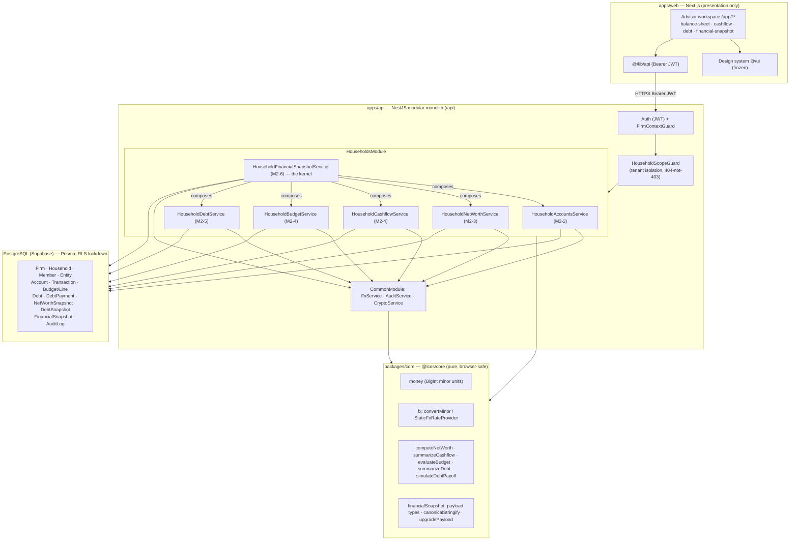
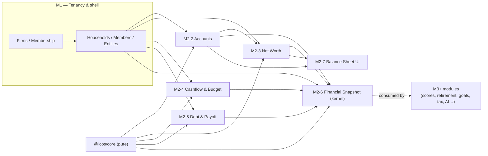
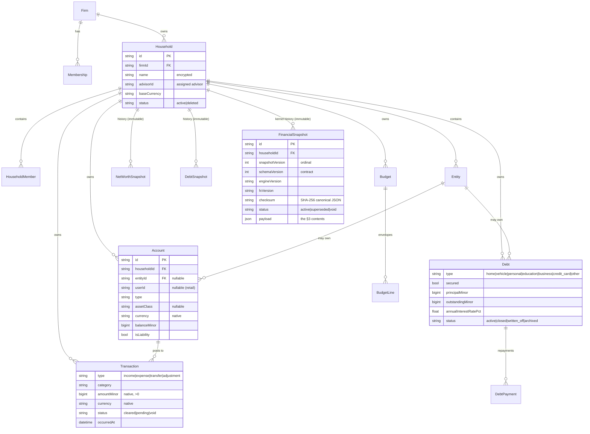
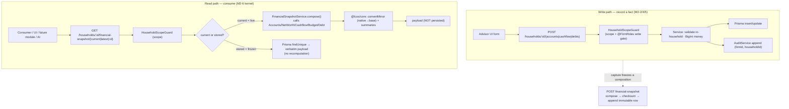
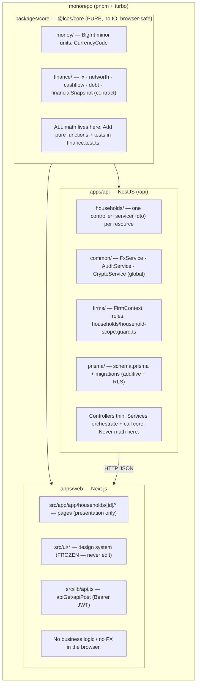
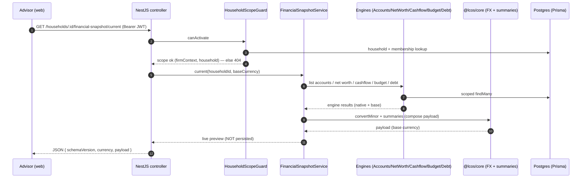
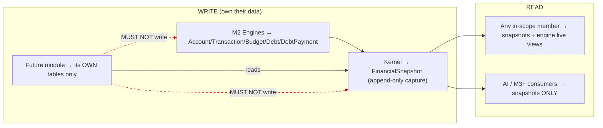

# Life Capital OS V2 — System Architecture

> **Permanent architecture reference**, written **after Module 2 shipped** (M2-2…M2-7 merged, PRs #15–#20).
> It documents the system **as implemented**, not an idealized design. Verified against the codebase at merge
> commit of PR #20. Companion docs: [`FINANCIAL_KERNEL_ARCHITECTURE.md`](./FINANCIAL_KERNEL_ARCHITECTURE.md),
> [`AI_INTEGRATION_ARCHITECTURE.md`](./AI_INTEGRATION_ARCHITECTURE.md),
> [`EXTENSION_GUIDELINES.md`](./EXTENSION_GUIDELINES.md), [`ADR-FINANCIAL-KERNEL.md`](./ADR-FINANCIAL-KERNEL.md),
> and the slice-level [M2 architecture reference](./M2_HOUSEHOLD_WEALTH_ARCHITECTURE.md) (ADR-001…012).

## Deliverables index

| # | Deliverable | Where |
| - | --- | --- |
| 1 | System Architecture | this document |
| 2 | Financial Kernel Architecture | [`FINANCIAL_KERNEL_ARCHITECTURE.md`](./FINANCIAL_KERNEL_ARCHITECTURE.md) |
| 3 | Component Diagram | this document, §2 |
| 4 | Domain Diagram | this document, §4 |
| 5 | Data Flow Diagram | this document, §5 |
| 6 | Financial Snapshot Lifecycle Diagram | [`FINANCIAL_KERNEL_ARCHITECTURE.md`](./FINANCIAL_KERNEL_ARCHITECTURE.md) §Lifecycle |
| 7 | Module Dependency Graph | this document, §3 |
| 8 | AI Integration Architecture | [`AI_INTEGRATION_ARCHITECTURE.md`](./AI_INTEGRATION_ARCHITECTURE.md) |
| 9 | Extension Guidelines + future-module validation | [`EXTENSION_GUIDELINES.md`](./EXTENSION_GUIDELINES.md) |
| 10 | ADR — Financial Kernel | [`ADR-FINANCIAL-KERNEL.md`](./ADR-FINANCIAL-KERNEL.md) |
| — | Architectural review (pre-M3) | this document, §9 |
| — | New-engineer onboarding (diagrams + mental model) | this document, §10 |
| — | Future Module Contract (READ allowlist / WRITE prohibitions) | [`FUTURE_MODULE_CONTRACT.md`](./FUTURE_MODULE_CONTRACT.md) |
| — | Explicit per-module extension points | [`EXTENSION_GUIDELINES.md`](./EXTENSION_GUIDELINES.md) §7 |

**Read order for a new senior engineer:** §10 (this doc) → [`FINANCIAL_KERNEL_ARCHITECTURE.md`](./FINANCIAL_KERNEL_ARCHITECTURE.md)
→ [`FUTURE_MODULE_CONTRACT.md`](./FUTURE_MODULE_CONTRACT.md) → [`EXTENSION_GUIDELINES.md`](./EXTENSION_GUIDELINES.md).

---

## 1. Overview

Life Capital OS V2 is a **multi-tenant advisory wealth platform**: advisory **firms** manage **households**
(families), each holding **accounts, cashflow, debt, net worth**, consolidated multi-currency into a
household base currency, and captured as **immutable Financial Snapshots** — the canonical read model.

**Monorepo (pnpm + turbo), three deployables:**

| Package | Stack | Responsibility |
| --- | --- | --- |
| `apps/api` | **NestJS 10**, global `/api` prefix | HTTP API; thin controllers → services → `@lcos/core`; auth, tenancy, persistence. |
| `apps/web` | **Next.js + Tailwind** | Advisor workspace (`/app/**`); reads the API over Bearer JWT; **presentation only**. Design system in `apps/web/src/ui/*` is **frozen**. |
| `packages/core` | **`@lcos/core`** — pure TypeScript, **browser-safe** (no Node/IO) | All finance math: money (BigInt minor units), FX, net worth, cashflow, budget, debt, and the Financial Snapshot **contract** (types + canonical serializer). |

**Persistence:** PostgreSQL (Supabase) via **Prisma**. **Every table has RLS lockdown** (RLS enabled, no
policies) so the Supabase PostgREST surface is closed; the app reaches Postgres only through Prisma's DB role.

**Core architectural laws** (enforced across all modules, ADR-001…012):

1. **Household is the aggregate root** — every financial row is scoped by `householdId` (+ `firmId`).
2. **FX lives only in the domain layer** — store native currency; convert at aggregation (ADR-003).
3. **Financial history is immutable** — snapshots are append-only, never updated/deleted (ADR-004).
4. **Migrations are additive** — new tables/nullable columns only; retail rows coexist (ADR-010).
5. **Thin controllers, pure core** — no business math in controllers or the browser.

---

## 2. Component Diagram

**Notes (as implemented):**
- One NestJS **modular monolith**; all household finance lives in `HouseholdsModule`
  (`apps/api/src/households/`), one `*.controller.ts` + `*.service.ts` (+ `*.dto.ts`) per resource.
- `FxService`, `AuditService`, `CryptoService` are **global** providers (`CommonModule`).
- The **kernel service composes the other five services** — it holds no aggregation math of its own.

---

## 3. Module Dependency Graph

**Direction of dependency is strict and acyclic:** engines depend on `@lcos/core` and the household
aggregate; the **kernel (M2-6) depends on all engines**; **future modules depend only on the kernel** (never
on raw engines/tables). This is the key property that lets Module 3+ be built without touching M2.

---

## 4. Domain Diagram

**Ownership boundaries (as implemented):**
- **Household-owned** by default (`householdId` set). **Entity-owned** when `entityId` (a legal entity in the
  same household) is set — supported on `Account` and `Debt`. **Individual/retail** rows keep `userId`
  (nullable on the advisory tables), coexisting with advisory rows (ADR-010).
- Names/taxIds are **encrypted at rest** (AES-256-GCM, `CryptoService`); monetary amounts are unencrypted
  `BigInt`, tenant-isolated (ADR-006).

---

## 5. Data Flow Diagram

**Write path** (record a financial fact) and **read path** (consume via snapshot):

**Invariants visible in the flow:**
- All money is **native `BigInt` minor units** at rest; **FX conversion to base happens only during
  composition/aggregation** in `@lcos/core` (ADR-003).
- `/current` is **computed live and never stored**; stored snapshots are returned **verbatim** (no
  recomputation — ADR-004).
- Every mutation is **audited**; every route is **scope-guarded**.

---

## 6. Tenancy, security & isolation (as implemented)

- **AuthN:** JWT bearer; `AuthUser` on the request.
- **AuthZ / tenancy:** `HouseholdScopeGuard` resolves `/households/:id`, derives its firm, requires an
  **active `Membership`**, then intersects with assignment:
  - **OWNER, ANALYST** → firm-wide read (any household in the firm).
  - **ADVISOR, SUPPORT** → only households they are the **assigned advisor** of.
  - Out-of-scope / cross-firm → **404** (never 403) so existence doesn't leak (NFR-2).
- **Write gate:** `@FirmRoles(OWNER, ADVISOR, SUPPORT)` on every mutation. **`ANALYST` is read-only**
  (reads firm-wide but cannot write); **`SUPPORT`** can write but only within its assigned households.
- **Audit:** append-only `AuditLog` via `AuditService` on every mutation (`{ firmId, householdId, … }`),
  ADR-005.
- **Encryption:** PII (household/member/entity names, taxIds) AES-256-GCM at rest (ADR-006).
- **RLS lockdown:** every table (incl. all M2 tables) has RLS enabled with no policies — Supabase PostgREST
  is closed; Prisma's DB role bypasses RLS.

---

## 7. FX & multi-currency (as implemented)

- **Supported currencies:** `INR, USD, EUR, GBP, AED, SGD` (`CurrencyCode` in `@lcos/core`); **100 minor
  units per major** for all, so a major-unit rate applies directly to minor units.
- **Storage:** every amount is stored in its **native** currency (`Account.currency`, `Transaction.currency`,
  `Debt.currency`); **no converted amount is stored** on transactional rows.
- **Conversion:** only in the domain layer via `FxService` (implements `@lcos/core FxRateProvider`) +
  `convertMinor` — at **aggregation** time (net worth, cashflow, debt, snapshot composition). Consolidated
  figures are in the **household base currency** (`Household.baseCurrency`).
- **Provider:** `StaticFxRateProvider` (defaults `DEFAULT_USD_PER_UNIT`), optionally overridden by the
  `FX_USD_PER_UNIT` env JSON. Swappable for a live feed **without touching call sites** (ADR-003).
- **Reproducibility:** `FxService.version` (`static-v1` / `static-override`) is **stamped into every
  Financial Snapshot** (`fxVersion`), so a past conversion is reproducible even after rates change.

---

## 8. What exists today (verified inventory)

| Engine | Service | Key routes (`/api/households/:id/…`) | Persistence |
| --- | --- | --- | --- |
| **Accounts** (M2-2) | `HouseholdAccountsService` | `GET/POST /accounts`, `PATCH/DELETE /accounts/:accountId` | `Account` |
| **Net Worth** (M2-3) | `HouseholdNetWorthService` | `GET /net-worth/current`, `POST /net-worth/snapshot`, `GET /net-worth/timeline` | `NetWorthSnapshot` (immutable) |
| **Cashflow** (M2-4) | `HouseholdCashflowService` | `GET/POST /cashflow`, `PATCH/DELETE /cashflow/:txId`, `GET /cashflow/summary`, `GET /cashflow/timeline` | `Transaction` |
| **Budget** (M2-4) | `HouseholdBudgetService` | `GET /budget`, `POST /budget` (upsert) | `Budget`, `BudgetLine` |
| **Debt & Payoff** (M2-5) | `HouseholdDebtService` | `GET/POST /debts`, `PATCH/DELETE /debts/:debtId`, `GET /debts/summary`, `GET /debts/payoff`, `GET/POST /debts/:debtId/payments`, `POST /debts/snapshot`, `GET /debts/timeline` | `Debt`, `DebtPayment`, `DebtSnapshot` (immutable) |
| **Financial Snapshot** (M2-6, **kernel**) | `HouseholdFinancialSnapshotService` | `POST /financial-snapshot`, `GET /financial-snapshot/{current, latest, timeline, :snapshotId}` | `FinancialSnapshot` (immutable) |
| **Balance Sheet UI** (M2-7) | — (web) | `/app/households/[id]/balance-sheet` (+ cashflow, debt, financial-snapshot pages) | — |

**Health baseline at M2 close:** 11 migrations (clean `migrate reset`, no drift); build 3/3; lint 4/4;
`@lcos/core` 60/60; API e2e 92/92 (13 suites). `main` deployable.

---

## 9. Architectural review (pre-Module-3)

### Strengths

- **Clean layering & acyclic dependencies.** Controllers are thin; all math is in pure `@lcos/core`; the
  kernel composes engines; future modules depend only on the kernel. This is the single biggest enabler of
  low-risk Module 3+ growth.
- **Immutability + reproducibility.** Three immutable snapshot series (net worth, debt, financial) with a
  checksum and engine/FX version stamps make history trustworthy and AI-groundable (ADR-004/012).
- **Disciplined multi-currency.** Native-at-rest + convert-at-aggregation, in one place, with a swappable
  provider (ADR-003). No mixed-currency sums anywhere.
- **Tenant isolation by construction.** One guard, 404-not-403, RLS lockdown on every table, append-only
  audit, encrypted PII. Consistent across all six resources.
- **Additive-only evolution.** Retail and advisory rows coexist; every migration verified drift-free; the
  snapshot payload is versioned so consumers never break.
- **Strong test coverage of the contract.** The reproducibility (byte-identical-after-mutation) and
  multi-currency assertions are the ones that matter, and they exist.

### Weaknesses / technical debt

- **`AuditLog.firmId` populated from metadata, not the column.** `AuditService` writes `{ firmId }` into
  `metadata`; the dedicated `firmId` column exists but isn't consistently backfilled — a tracked follow-up
  (noted in ADR-005). Tenant-scoped audit queries are weaker until fixed.
- **`snapshotVersion` is best-effort (no unique constraint).** Concurrent captures could share an ordinal
  (documented; `capturedAt+id` is authoritative). Fine now; a per-household advisory lock or unique index
  would harden it.
- **`householdEquity` reconciliation is an assumption, not a link.** `reconciledEquity = netWorth −
  totalDebt` assumes debts are **not** also liability accounts (no FK between `Debt` and `Account`). Correct
  for the common case, but a genuine link (or a `Debt.accountId`) would make it exact.
- **No cursor pagination yet.** Account/transaction/debt lists and snapshot payloads (`assets[]`,
  `liabilities[]`) are unbounded. Fine for typical households; large books need `skip/take` (the `{ total,
  data }` convention exists elsewhere).
- **FX is static/config only.** Correct by design for now, but there is no historical rate table — `fxVersion`
  records *which* set was used but not the *rates themselves*. A live/historical provider is future work.
- **`.env`-driven local verification.** DB/verification setup is manual (documented in `PROJECT_MEMORY`);
  no CI-managed ephemeral Postgres for e2e beyond the GitHub `build-test` job.
- **Encryption key governance** (KMS, rotation) is an M0 item; dev key fallback exists.

### Scalability risks

- **JSON payload growth.** `FinancialSnapshot.payload` embeds `assets[]`/`liabilities[]`/`entityHoldings[]`.
  For a family office with thousands of holdings, payloads get large; mitigations: payload pagination in a
  future `schemaVersion`, or storing line items relationally with a JSON summary.
- **Snapshot cadence storage.** Append-only history grows unbounded; a pruning/retention policy (and the
  deferred M0 scheduled-capture worker) should land before high-frequency capture.
- **Composition cost on `/current`.** Live composition fans out to five services + FX each call; it's
  O(household size) and uncached. Heavy dashboards should read **stored** snapshots (O(1)); `/current` is a
  preview, not a hot path.
- **Single Postgres, single monolith.** Appropriate now; module boundaries are clean enough to extract
  services later if needed. Read replicas / caching are the first levers.

### Recommended improvements before Module 3

1. **Backfill `AuditLog.firmId`** from metadata and write it directly going forward (small, high-value for
   compliance queries).
2. **Add a read-model accessor the way future modules will use it** — a documented, stable
   `FinancialSnapshotService.latest()/getById()` is the only kernel entry point M3 should touch (already
   exists; enshrine it in `EXTENSION_GUIDELINES`).
3. **Introduce pagination** (`skip/take`, `{ total, data }`) on account/transaction/debt lists before books
   grow — additive, cheap now.
4. **Decide the debt↔account link** (optional `Debt.accountId`) so `householdEquity` is exact — additive
   column, no reshaping.
5. **Add a Financial Health Score as the first M3 consumer** — it's a pure function of one snapshot and will
   validate the kernel contract end-to-end with minimal surface (see `EXTENSION_GUIDELINES`).
6. **Keep the payload versioned and additive** — never mutate `schemaVersion 1`; new needs → optional fields
   or `schemaVersion 2` with an up-converter.

**Verdict:** the architecture is **sound and ready for Module 3 without redesign.** The weaknesses are
localized, additive to fix, and none block the future-module set (see `EXTENSION_GUIDELINES` validation).

---

## 10. New-engineer onboarding

Read this section first. It is the 15-minute mental model for a senior engineer joining the codebase.

### 10.1 The one idea

> **Engines record facts. The kernel freezes them into an immutable, versioned snapshot. Everything else
> reads snapshots.** Money is `BigInt` minor units, stored native, converted to the household base currency
> only when aggregating. Every row is scoped to a household inside a firm.

### 10.2 Where code lives (orientation map)

**First files to open, in order:** `packages/core/src/finance/financialSnapshot.ts` (the contract) →
`apps/api/src/households/household-financial-snapshot.service.ts` (how the kernel composes engines) →
`apps/api/src/households/household-scope.guard.ts` (tenancy) → `apps/api/prisma/schema.prisma` (data model).

### 10.3 Request lifecycle (read a snapshot)

For **capture** (`POST`), the same flow adds: checksum over canonical JSON → insert **immutable** row
(`snapshotVersion = count+1`) → append `AuditLog`. For a **write** to an engine (e.g. `POST /cashflow`), the
guard additionally enforces `@FirmRoles(OWNER, ADVISOR, SUPPORT)` before the service validates + persists +
audits.

### 10.4 Read vs write responsibilities (who may touch what)

Full normative rules: [`FUTURE_MODULE_CONTRACT.md`](./FUTURE_MODULE_CONTRACT.md).

### 10.5 Conventions a new engineer must know (learned the hard way)

- **Never run `prisma format`** — `schema.prisma` isn't canonical-formatted on `main`; it reformats the whole
  file into a huge unrelated diff. Edit models by hand.
- **Migrations are additive + RLS-locked.** New table → `ENABLE ROW LEVEL SECURITY` (no policies). New column
  → nullable. Verify `migrate reset` + `migrate diff` (no drift) locally.
- **Money is `BigInt` minor units** at rest; serialize to `Number` only at the API boundary; **FX only in the
  domain layer** via `FxService`.
- **404-not-403** for out-of-scope households (don't leak existence).
- **Immutable snapshots**: no update/delete — corrections are new captures.
- **The `apps/web/src/ui/*` design system is frozen** — compose it, never edit it.
- **One milestone per PR, draft PRs, never merge without approval, keep `main` deployable** (the engineering
  workflow).

### 10.6 Local verification (health suite)

`migrate reset` (clean) + `migrate diff` (no drift) → `pnpm build` (3/3) → `pnpm lint` (4/4) →
`@lcos/core` tests → seed → API e2e. Green baseline at M2 close: 11 migrations, build 3/3, lint 4/4, core
60/60, e2e 92/92.
