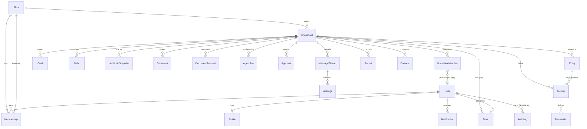

# 05 — Database Schema & Entity Relationships

> **Doc:** Data model for Phase 2. **Status:** Draft for review. **No schema changes are made in
> this document** — it specifies what the Phase 2 migrations will add.
> **Related:** [Modules](./02_MODULES.md) · [Roles](./04_ROLES_PERMISSIONS.md) · [API](./06_API_SERVICE_ARCHITECTURE.md)

The existing 17 V2 models (`User`, `Profile`, `FamilyMember`, `Account`, `Transaction`, `Debt`,
`Goal`, `NetWorthSnapshot`, `Recommendation`, `Plan`, `Subscription`, `FeatureOverride`,
`FeatureFlag`, `Consent`, `RefreshToken`, `OtpCode`, `AuditLog`) are the source of truth in
`apps/api/prisma/schema.prisma`. Phase 2 **adds tables and adds nullable scoping columns**; it does
**not** reshape existing coherent models. Money stays **`BigInt` minor units**; PII stays
**AES-256-GCM encrypted** via `CryptoService`.

---

## 1. Design rules (non-negotiable)

1. **Additive, not destructive.** New tables + new nullable columns. Backfill in a data migration,
   then tighten to `NOT NULL` in a follow-up once populated (avoids breaking existing rows).
2. **Tenancy column everywhere.** Every firm-owned table carries `firmId`. Every household-owned
   table also carries `householdId`. (See risk **R-TEN**.)
3. **RLS lockdown on every new table** (matches the V2 `enable_rls_lockdown` migration — RLS on,
   no policies, Prisma-owner access only). No table ships without it.
4. **Cascade discipline.** User-owned cascades stay; new relations declare explicit `onDelete`.
   Household delete cascades its children; firm delete is guarded (SUPERADMIN, soft-delete first).
5. **Encrypt new PII** (names, document metadata that identifies a person, message bodies as needed).
6. **Indexes** on every foreign key and on `(firmId)`, `(householdId)`, `(status)`, due dates.

---

## 2. New enums (Phase 2)

```prisma
enum FirmRole      { OWNER  ADVISOR  ANALYST  SUPPORT }          // firm-scoped staff role
enum HouseholdRole { OWNER  MEMBER   VIEWER }                     // client-scoped role
enum EntityType    { individual  huf  trust  llp  company  other }
enum DocumentType  { statement  policy  will  deed  kyc  tax  agreement  other }
enum DocStatus     { uploaded  scanning  clean  quarantined  archived }
enum TaskStatus    { open  in_progress  blocked  done  cancelled }
enum TaskPriority  { low  medium  high  urgent }
enum AgentKind     { wealth_analyst  allocation  protection  document  ops  report }
enum AgentRunStatus{ queued  running  succeeded  failed  degraded }
enum NotifChannel  { in_app  email }
enum NotifCategory { alert  task  approval  report  message  system }
enum ApprovalStatus{ pending  approved  declined  expired }
```

Existing enums (`Role`, `PlanTier`, `AccountType`, `AssetClass`, `TransactionType`, `DebtType`,
`GoalType`, `RiskTolerance`, `SubscriptionStatus`) are unchanged. `PlanTier` may gain firm tiers
(e.g. `firm_starter`, `firm_pro`) in MOD-12 — additive.

---

## 3. New core models (specified, not yet written)

> Field lists are the intended shape for the migration; types mirror existing conventions
> (`cuid()` ids, `BigInt` money, `DateTime` timestamps, encrypted PII noted).

### 3.1 Tenancy & membership

```prisma
model Firm {
  id            String   @id @default(cuid())
  name          String
  brandName     String?          // for report branding
  logoKey       String?          // object-storage key
  baseCurrency  String   @default("INR")
  reviewCadence String   @default("quarterly")
  status        String   @default("active")   // active | suspended | deleted
  planId        String?          // firm-level plan (MOD-12)
  createdAt     DateTime @default(now())
  updatedAt     DateTime @updatedAt

  memberships   Membership[]
  households    Household[]
  @@index([status])
}

model Membership {
  id        String   @id @default(cuid())
  firmId    String
  userId    String
  firmRole  FirmRole @default(SUPPORT)
  status    String   @default("active")   // active | invited | disabled
  invitedAt DateTime @default(now())
  firm      Firm     @relation(fields: [firmId], references: [id], onDelete: Cascade)
  user      User     @relation(fields: [userId], references: [id], onDelete: Cascade)
  @@unique([firmId, userId])
  @@index([userId])
}
```

### 3.2 Household, members, entities

```prisma
model Household {
  id           String   @id @default(cuid())
  firmId       String
  name         String                    // encrypted (family name)
  advisorId    String?                   // assigned advisor (User)
  baseCurrency String   @default("INR")
  status       String   @default("active")
  createdAt    DateTime @default(now())
  updatedAt    DateTime @updatedAt

  firm         Firm             @relation(fields: [firmId], references: [id], onDelete: Cascade)
  members      HouseholdMember[]
  entities     Entity[]
  // accounts, goals, debts, documents, tasks, snapshots — via householdId FKs below
  @@index([firmId])
  @@index([advisorId])
}

model HouseholdMember {
  id           String        @id @default(cuid())
  householdId  String
  userId       String?                    // set when the member has a portal login
  name         String                     // encrypted
  relation     String
  dateOfBirth  DateTime?
  isDependent  Boolean       @default(true)
  householdRole HouseholdRole @default(MEMBER)
  household    Household     @relation(fields: [householdId], references: [id], onDelete: Cascade)
  @@index([householdId])
  @@index([userId])
}

model Entity {
  id          String     @id @default(cuid())
  householdId String
  firmId      String
  name        String                       // encrypted
  type        EntityType @default(individual)
  taxId       String?                      // encrypted
  createdAt   DateTime   @default(now())
  household   Household  @relation(fields: [householdId], references: [id], onDelete: Cascade)
  @@index([householdId])
  @@index([firmId])
}
```

> **Note on `FamilyMember` (V2):** it stays for the retail/free single-user tier. In the advisory
> product, `HouseholdMember` is the equivalent at household scope. A migration can, per household,
> map a former user's `FamilyMember`s into `HouseholdMember`s when a retail user is converted; the
> two coexist rather than one replacing the other abruptly.

### 3.3 Documents

```prisma
model Document {
  id           String       @id @default(cuid())
  firmId       String
  householdId  String
  entityId     String?
  memberId     String?                     // HouseholdMember scope (optional)
  uploadedById String                      // User
  type         DocumentType @default(other)
  title        String                      // encrypted if identifying
  storageKey   String                      // object-storage key (S3/R2)
  mimeType     String
  sizeBytes    Int
  status       DocStatus    @default(uploaded)
  version      Int          @default(1)
  supersedesId String?                     // previous version
  tags         String[]
  retainUntil  DateTime?
  createdAt    DateTime     @default(now())
  @@index([firmId])
  @@index([householdId])
  @@index([type])
}

model DocumentRequest {
  id          String    @id @default(cuid())
  firmId      String
  householdId String
  requestedById String                     // advisor
  memberId    String?                       // who should fulfil
  title       String
  note        String?
  status      String    @default("open")    // open | fulfilled | cancelled
  fulfilledDocumentId String?
  dueAt       DateTime?
  createdAt   DateTime  @default(now())
  @@index([householdId])
}
```

### 3.4 Tasks & workflows

```prisma
model Task {
  id          String       @id @default(cuid())
  firmId      String
  householdId String?                        // null = firm-level task
  title       String
  description String?
  assigneeId  String?                        // User
  createdById String
  status      TaskStatus   @default(open)
  priority    TaskPriority @default(medium)
  dueAt       DateTime?
  relatedDocumentId String?
  relatedGoalId     String?
  templateId  String?                        // WorkflowTemplate instance origin
  completedAt DateTime?
  createdAt   DateTime     @default(now())
  updatedAt   DateTime     @updatedAt
  @@index([firmId])
  @@index([householdId])
  @@index([assigneeId, status])
  @@index([dueAt])
}

model WorkflowTemplate {
  id        String   @id @default(cuid())
  firmId    String
  name      String                           // e.g. "Annual Review"
  steps     Json                             // ordered task specs
  active    Boolean  @default(true)
  createdAt DateTime @default(now())
  @@index([firmId])
}
```

### 3.5 AI agent runs

```prisma
model AgentRun {
  id          String         @id @default(cuid())
  firmId      String
  householdId String?
  kind        AgentKind
  status      AgentRunStatus @default(queued)
  triggeredById String?                      // User or "system"
  inputHash   String?                        // hash of grounding snapshot (repro/audit)
  model       String?
  tokensIn    Int?
  tokensOut   Int?
  summary     String?                        // short outcome
  outputRef   String?                        // storage key / row ref for full output
  error       String?
  startedAt   DateTime?
  finishedAt  DateTime?
  createdAt   DateTime       @default(now())
  @@index([firmId])
  @@index([householdId])
  @@index([kind, status])
}
```

### 3.6 Notifications

```prisma
model Notification {
  id          String        @id @default(cuid())
  firmId      String
  userId      String                          // recipient
  householdId String?
  category    NotifCategory
  title       String
  body        String?
  linkHref    String?
  readAt      DateTime?
  createdAt   DateTime      @default(now())
  @@index([userId, readAt])
  @@index([firmId])
}

model NotificationPreference {
  id       String        @id @default(cuid())
  userId   String
  category NotifCategory
  channel  NotifChannel
  enabled  Boolean       @default(true)
  @@unique([userId, category, channel])
}

model EmailOutbox {                            // reliable async email (job runner drains it)
  id        String   @id @default(cuid())
  toUserId  String?
  toEmail   String
  template  String
  payload   Json
  status    String   @default("pending")       // pending | sent | failed
  attempts  Int      @default(0)
  createdAt DateTime @default(now())
  @@index([status])
}
```

### 3.7 Approvals, messaging, reports

```prisma
model Approval {
  id          String         @id @default(cuid())
  firmId      String
  householdId String
  requestedById String                          // advisor
  approverId  String?                            // HouseholdMember/User
  title       String
  detail      String?
  status      ApprovalStatus @default(pending)
  decidedAt   DateTime?
  createdAt   DateTime       @default(now())
  @@index([householdId, status])
}

model MessageThread {
  id          String   @id @default(cuid())
  firmId      String
  householdId String
  subject     String?
  createdAt   DateTime @default(now())
  @@index([householdId])
}

model Message {
  id        String   @id @default(cuid())
  threadId  String
  senderId  String
  body      String                              // encrypted
  readAt    DateTime?
  createdAt DateTime @default(now())
  @@index([threadId])
}

model Report {
  id          String   @id @default(cuid())
  firmId      String
  householdId String?                            // null = firm-level report
  kind        String                             // household | firm_book
  periodStart DateTime?
  periodEnd   DateTime?
  status      String   @default("queued")        // queued | generating | ready | failed
  storageKey  String?                            // generated PDF
  generatedById String?
  createdAt   DateTime @default(now())
  @@index([firmId])
  @@index([householdId])
}
```

---

## 4. Scoping columns added to existing models

Added as **nullable** first, backfilled, then constrained. Existing `userId` relations are kept for
backward compatibility with the retail tier; advisory records are keyed by `householdId`/`firmId`.

| Model | New columns | Purpose |
|---|---|---|
| `Account` | `firmId?`, `householdId?`, `entityId?` | scope to household/entity in advisory mode |
| `Transaction` | `firmId?`, `householdId?` | scope cashflow |
| `Debt` | `firmId?`, `householdId?` | scope liabilities |
| `Goal` | `firmId?`, `householdId?`, `memberId?` | scope goals; link to a member |
| `NetWorthSnapshot` | `firmId?`, `householdId?` | per-household timeline |
| `Recommendation` | `firmId?`, `householdId?` | persist Top Actions per household (wire the V2 dead table) |
| `Consent` | `firmId?`, `householdId?` | consent at household scope (DPDP) |
| `AuditLog` | `firmId?` | tenant-scoped audit |
| `Subscription`/`Plan` | firm linkage (MOD-12) | firm-level billing |
| `User` | `activeFirmId?` | last-used firm context for multi-firm users |

---

## 5. Entity-relationship diagram (target)



(Existing V2 relations — `User→Account/Transaction/Debt/Goal/FamilyMember/NetWorthSnapshot` — remain
for the retail tier and are omitted above for clarity.)

---

## 6. Migration strategy

1. **M1a — tenancy tables:** add `Firm`, `Membership`, `Household`, `HouseholdMember`, `Entity`,
   new enums; RLS lockdown; indexes. No changes to existing tables yet.
2. **M1b — scoping columns (nullable):** add `firmId?`/`householdId?`/`entityId?`/`memberId?` to
   existing models; backfill for any existing data (retail users → a personal household, optional).
3. **M2 — documents & storage:** `Document`, `DocumentRequest` (paired with object-storage setup).
4. **M3 — tasks/workflows:** `Task`, `WorkflowTemplate`.
5. **M4 — notifications & email:** `Notification`, `NotificationPreference`, `EmailOutbox`.
6. **M5 — agents:** `AgentRun`.
7. **M6 — approvals/messaging/reports:** `Approval`, `MessageThread`, `Message`, `Report`.
8. **Tighten:** once backfilled and code paths use them, follow-up migrations set scoping columns
   `NOT NULL` where invariant.

Each migration: RLS lockdown on new tables, indexes on FKs + scope columns, and a matching seed
update. Every step is reversible in dev (down migration) and tested in CI before deploy.

---

## 7. Data-integrity & compliance notes

- **Multi-currency (R-FX):** balances keep their native `currency`; aggregation converts to
  `Household.baseCurrency` via an FX boundary in `@lcos/core` before summing (NFR-8). No mixed-unit sums.
- **Encryption governance (highest risk, R-KEY):** establish KMS-managed keys + strict-mode decrypt
  **before** encrypting the new PII fields (household/member/entity names, message bodies).
- **DPDP scope:** export/erasure operate at **household** granularity; `Consent` rows are
  household/member scoped and versioned.
- **Audit:** `AuditLog.firmId` lets the audit viewer be tenant-scoped for firm owners.
